# How the Keyword Stats Refresh Works Now

A plain-English walkthrough of the Keywords Explorer rollup script — what it does, why it changed, and what to expect when you run it.

**File:** `scripts/refresh-keyword-stats-safe.js`
**Updated:** 23 Sep 2026

## In short

- This script keeps the **Keywords Explorer** page's numbers (ads per keyword, competition, growth) up to date, without the slow, timed-out queries the old version had.
- It now reads ads from **Elasticsearch** instead of MySQL, and processes them **one calendar month at a time** — newest month first, then working backward through history.
- This fixes a real gap the old design had: an ad that gets updated later (new keyword, refreshed activity) used to be invisible to the rollup forever. Now it's always caught, because updates always land in the current month.
- Advertiser and domain counts are now **exact**, not estimated — a small permanent table remembers which advertiser/domain combinations have been seen per keyword.

## 1. What this script actually does

The Keywords Explorer page shows, for every keyword people search for in PowerAdSpy, things like: how many ads exist for it, how many different advertisers are running it, which country it's most popular in, and whether it's trending up or down.

Those numbers don't come from scanning the whole ads database every time someone loads the page — that would be far too slow. Instead, this script runs on a schedule, walks through the ads, and keeps a table called `keyword_stats_unique` updated with the latest totals. The Explorer page just reads that table.

So this script is the thing that keeps Keywords Explorer's numbers true. If it stops running, or misses ads, the numbers on that page quietly go stale.

## 2. The problem with the old version

The previous version walked through ads in the order they were created (their database `id`), counting each one exactly once, forever. That was safe — an ad could never be double-counted — but it had a real blind spot:

> **The gap.** When an ad gets **re-crawled** later — say it's still running three months after it first appeared — the system updates that same ad's record: refreshes its "last seen" date, and can even add a brand-new keyword to it if one wasn't there before.
>
> Since the old script only ever looked at each ad *once*, at whatever point its id came up in the walk, it never saw that later update. A keyword that got added to an ad after the walk had already passed it would never show up in Keywords Explorer — not eventually, not ever.

This was discovered by checking the real update code: when an ad is re-seen, its keyword list gets *merged* with whatever's new, never replaced or removed. So the old design wasn't just slightly stale — it could permanently miss real keywords.

## 3. The fix: walk by "last seen," one month at a time

The new design walks ads by their **`last_seen`** date instead of their id — and it processes one calendar month of ads at a time, starting with the most recent month and working backward through history.

This works because of one important fact: **a month that isn't the current one can never change again.** If an old ad gets updated today, its "last seen" becomes *today* — which moves it out of whatever old month it used to belong to and into the current month. A past month is frozen the moment it stops being current.

1. **Find "now," from the data itself.** Not the calendar date — the month of the most recent ad that actually has a keyword. (Early on, this caught a subtle bug: one very recent ad in the test data had no keyword at all, so using it as "now" would have looked at an empty month forever. The fix looks at the newest ad *with* a keyword.)
2. **Work the current month first, always.** Every run checks the current month before anything else. Since it can still receive new or updated ads, it's re-checked every time, never marked "finished."
3. **Once the current month has nothing new, start working backward.** The script steps to the month before it, processes every ad in it, and — because that month can never change again — marks it permanently done.
4. **Keep stepping back, one month at a time.** Each finished month is closed out and never revisited. The next run (or the next loop, in the same run) picks up the oldest month that still needs doing.
5. **Stop once the oldest real data is reached.** The script knows where history actually starts (the earliest month with any keyword-bearing ad), so it doesn't wander into empty years forever.
6. **After that, just keep checking the current month.** With history fully covered, every future run only needs to check what's new right now — which is exactly the case the design is built to handle correctly.

> **Why this actually fixes the missed-update problem.** An ad that gets updated always has its "last seen" bumped to right now — so it always resurfaces in the current month, which is the one bucket that's always re-checked. It can never hide in a "finished" past month, because updating it is exactly what would move it out of that month in the first place.

**How far back backfill goes.** In production, backfill is capped at **January 2020** — it will never walk further back than that, even if real ads exist earlier. This is a hardcoded value in the script (`FLOOR_YEAR = 2020`), not something you pass on the command line, and it only takes effect when the run is started with `--prod` (see Section 10). Without `--prod` — the default, used for local/dev testing — there's no cap: backfill walks all the way to wherever the real data actually starts.

## 4. How one batch updates `keyword_stats_unique`

This is what happens for every batch of ads the script pulls, start to finish.

```mermaid
flowchart TD
    A["Fetch the next batch of ads from Elasticsearch<br/>(bounded to the current month's window)"] --> B{"Any ads found?"}
    B -- "No" --> Z["Month is done — see Section 3"]
    B -- "Yes" --> C["For each ad, look up its<br/>post_owner_id / domain_id<br/>from MySQL google_text_ad"]
    C --> D["Split each ad's keyword list<br/>into individual keywords<br/>(one ad can carry several)"]
    D --> E["Drop anything that looks like<br/>junk data — see Section 6"]

    subgraph TX["Everything below happens in ONE database transaction — all of it is saved together, or none of it is"]
        F["Store (keyword, advertiser, domain, ad id)<br/>in the keyword_ad table — duplicates ignored<br/>&#40;this is what makes advertiser/domain counts exact&#41;"]
        G["Add up this batch's numbers per keyword:<br/>ad count, countries, categories,<br/>dates, organic-ad flag..."]
        H["Look up each keyword's EXISTING row<br/>in keyword_stats_unique"]
        I["Look up the keyword's TRUE advertiser<br/>and domain counts from keyword_ad"]
        J["Merge: add this batch's numbers onto<br/>the existing totals &#40;advertiser/domain counts<br/>are replaced with the exact ones just looked up&#41;"]
        K["Write the merged totals back<br/>to keyword_stats_unique"]
        L["Record this batch's progress in<br/>keyword_stats_refresh_state"]
        F --> G --> H --> I --> J --> K --> L
    end

    E --> F
    L --> M{"More ads left in this month?"}
    M -- "Yes" --> A
    M -- "No" --> Z
```



The transaction matters because it makes a batch **all-or-nothing**: if anything fails partway through, nothing from that batch is left half-saved, and the batch is simply tried again from the same starting point next time — no ad can end up double-counted or silently skipped.

## 5. Where the ads actually come from

Ad content — including the keyword list — is read from **Elasticsearch**, not MySQL. Elasticsearch is the source of truth for `target_keyword`; MySQL's copy of it (in `google_text_ad_variants`) is only used as a much faster way to answer "what's the earliest/latest month with real data," since it's indexed and a query there takes a few milliseconds instead of an Elasticsearch aggregation.

Two other pieces of information — which advertiser and which domain an ad belongs to — still come from MySQL's `google_text_ad` table, since that's the cleaner, deduplicated source for those.

## 6. What's exact now, and what's still approximate

Because the script processes each ad exactly once and never re-derives totals from scratch, most numbers are built up by *adding* each batch's contribution onto what's already stored. Most of that is exact. A couple of fields are still best-effort approximations, and it's worth knowing which is which.

| Field | Status | How |
|---|---|---|
| `ads_total` | **Exact** | A running sum of every ad seen for that keyword. |
| `advertisers_total` / `domains_total` | **Exact** | A small permanent table (`keyword_ad`) remembers every (keyword, advertiser, domain) combination ever seen, so these are a true distinct count, not a sum-of-batches guess. |
| `first_seen` / `last_seen` | **Exact** | Simple min/max, safe to combine across batches. |
| `countries` / `categories` / `sub_categories` | **Exact** | Stored as full lists — every value ever seen for that keyword, not just one. |
| `category` / `sub_category` / `top_country` | Approximate | The single "headline" value shown on the page — whichever was seen first, since merging a true majority across batches isn't possible without extra bookkeeping. |
| `ads_30d` / `ads_prior_30d` / `growth_pct` | Approximate | Each batch measures "last 30 days" against the moment it ran, so an older batch's window doesn't slide forward with today's date. |

## 7. Other changes bundled into this redesign

**Organic-search ads are now counted.** The old version skipped ads whose type was "organic search" (unpaid results). That's no longer the case — every ad with a keyword counts, and a new `organic_search` flag on each keyword shows whether it has at least one such ad.

**Junk keywords are filtered out.** A handful of real ad documents were found with garbage in their keyword field — a raw Elasticsearch error message, a Kibana log line, even invisible characters — apparently from an upstream lookup that failed and got saved by mistake instead of being discarded. The script now recognizes and skips these patterns automatically, so they never reach the stats table.

**The originating ad is kept for tracing.** The `keyword_ad` table (the one that makes advertiser/domain counts exact) also keeps one real ad id per combination it stores, so any row can be traced back to an actual ad if something needs checking.

## 8. Performance choices, explained

**Why month by month, not the whole database at once.** Elasticsearch 6.x (what's currently running in prod) has to count every document a query matches, every single time — there's no way to skip that. A query with no real boundaries ends up matching almost the entire dataset on every request, which measured at multiple seconds per request against prod-sized data. Bounding each query to one calendar month keeps every request's matched set small and its cost low and predictable, no matter how deep into history the walk goes.

**Batch size grows automatically for busy months.** A quiet month might have a handful of ads; a busy one can have thousands. Rather than always fetching a fixed number per request, the script checks each month's real count first and automatically requests more per hit when there's more to get — up to a safe ceiling, comfortably under Elasticsearch's hard 10,000-result limit — so a dense month still finishes in as few round trips as reasonably possible.

**Skipping the "are you sure it's empty?" check.** Once a month's batches add up to the exact count the script already confirmed at the start, there's no need to ask Elasticsearch one more time just to hear "yes, still empty." That extra request — and even the extra bookkeeping row that used to come with it — is now skipped for any month that isn't the current one, since a finished month is guaranteed not to change.

## 9. Bugs found and fixed along the way

Several of these only showed up once the redesign was tested against real data, not just small local test data. Listed here so the history isn't lost.

**[Timezone] Dates were interpreted two different ways.**
Elasticsearch treats a plain date string as UTC. An early version of the month-boundary code used the local machine's timezone (IST, five and a half hours off) instead, which silently misaligned every window. Fixed by doing all date math in UTC, and by pulling MySQL's dates as plain text rather than letting the database driver reinterpret them — the same class of bug showed up there too, independently.

**[Logic] Backfill never actually started.**
The very first version of "step back through history" only worked once at least one past month already had a record — but nothing ever created that first record, so the walk would finish the current month and then just stop, forever. Fixed by explicitly kicking off the first backward step the moment the current month is found to be caught up.

**[Logic] A genuinely empty month caused an infinite retry.**
Real data has stretches with zero keyword-bearing ads in an entire month. The script used to only record a month as "done" if it had processed at least one ad — so a truly empty month left no trace, and the walk would retry that same empty month forever. Fixed by always recording that a month was checked, even when it held nothing.

**[Logic] The walk looped forever once history was fully caught up.**
After successfully reaching the oldest real month, the script would keep re-checking the current month, log "moving to backfill," and loop — without ever actually stopping, even with nothing new to do. The check for "is there truly nothing left anywhere" existed, but only in one of the two places the code could reach that situation from. Fixed by adding the same check to both.

**[Logic] Dry run looped forever on a month it had already finished.**
`--dry-run` (see Section 10) rolls back every write, including the row that normally marks a month "done" — so on the next loop iteration the script had no memory that it had just finished that month, asked the database again, got the same stale answer, and retried it forever. Reproduced live (a real dry run stuck repeating "month=2026-08 ... nothing left"). Fixed with an in-memory list of months the dry run has already finished, checked before trusting the database's answer — real runs don't need this, since their completed-month rows are genuinely saved.

## 10. How to run it

**Modes** — pick at most one. Leaving all three out behaves like `--resume`.

| Flag | What it does |
|---|---|
| *(none)* / `--resume` | Continue from wherever the last run left off. This is the normal, everyday way to run it. |
| `--start` | Empties `keyword_ad`, `keyword_stats_unique` and `keyword_stats_refresh_state`, then runs from a completely clean slate. Use this once after a change that affects every keyword's numbers (like this redesign), so nothing old is left mixed in with the new fields. |
| `--revert` | Empties those same three tables and then stops — does **not** process any ads. Use this to wipe out a test run before doing anything real. |

**Other important flags:**

| Flag | What it does |
|---|---|
| `--prod` | Turns on the January-2020 backfill floor described in Section 3. Only affects how far back backfill goes — leave it off for local/dev testing so it can walk the full real history. |
| `--dry-run` | Runs everything for real — real Elasticsearch fetches, real MySQL reads and lookups, real number-crunching — but every write is rolled back at the end, so nothing is actually saved. Safe to run against real data to see what a real run *would* do, including its advertiser/domain counts, without touching anything. Cannot be combined with `--start` or `--revert` (those wipe tables for real, immediately — that would contradict "dry run"). |
| `--loop` | Once history is fully caught up, keeps checking the current month on a short idle loop instead of exiting. |
| `--batch=N` | How many ads to fetch per request (default 500, safe up to 5000). |
| `--pause-every=N --pause-ms=M` | Adds a longer pause of `M` milliseconds every `N` batches, on top of the normal pace — useful for spreading a big backfill out over time instead of hitting the database as fast as possible. |

**Run once, normal use** — continues from where it left off, works the current month, then steps backward through history until told to stop or it hits the floor.
```
node scripts/refresh-keyword-stats-safe.js
```

**Keep running indefinitely** — once history is fully caught up, this keeps checking the current month instead of exiting.
```
node scripts/refresh-keyword-stats-safe.js --loop
```

**Production, first run** — clean slate, capped at January 2020, paced with a 30-second pause every 10 batches so it doesn't hammer prod while backfilling years of history.
```
node scripts/refresh-keyword-stats-safe.js --start --prod --pause-every=10 --pause-ms=30000
```

**Production, ongoing** — same pacing, just resuming instead of wiping.
```
node scripts/refresh-keyword-stats-safe.js --prod --pause-every=10 --pause-ms=30000
```

**See what a production run would do, without touching anything** — real data, real numbers, nothing saved.
```
node scripts/refresh-keyword-stats-safe.js --dry-run --prod
```

**Local/dev, clean slate** — no floor cap, so it backfills the full real local history.
```
node scripts/refresh-keyword-stats-safe.js --start
```

**Undo a test run** — wipes the three tables back to empty and stops.
```
node scripts/refresh-keyword-stats-safe.js --revert
```

## 11. How confident should we be in this

Every piece described above — the month walk, the exact advertiser/domain counting, the junk-keyword filter, the `--start`/`--resume`/`--revert` modes, the `--dry-run` rollback mechanism, each bug fix — was tested against a real local Elasticsearch and MySQL, not just reasoned through. That included deliberately building test data with the exact awkward shapes that break things: many ads sharing one timestamp, months with gaps, mid-month interruptions and resumes, and a month with a single ad. The full real local dataset (38 months, September 2022 through February 2026) was also walked end to end, and its per-month counts matched an independent check against Elasticsearch exactly. `--dry-run` was additionally run against a real prod-shaped sample (real advertiser/domain data, loaded temporarily for the test and removed afterward) to confirm it produces real numbers without saving anything.

What hasn't been exercised yet is a full run against actual production scale end-to-end (only a prod-shaped sample, loaded locally, has been tested), and a real month-to-month rollover in a long-running `--loop` process — both worth watching the first time they happen for real.

---
*Written for the PowerAdSpy team — covers the Keywords Explorer rollup work completed 22–23 September 2026.*
