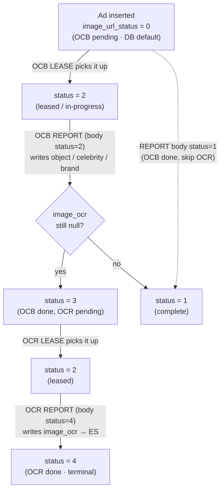

# OCR & OCB Image-Tagging Pipeline — Complete API Documentation

> **OCB** = **O**bject + **C**elebrity + **B**rand-logo detection (visual tags in the image).
> **OCR** = text-in-image detection (reads text baked into the creative).
>
> Each platform exposes **two calls**: a **LEASE** (`GET` — hands out image ads to process) and a **REPORT** (`POST` — sends results back to MySQL + Elasticsearch). External workers/scrapers call LEASE to get work, run their vision/OCR models, then call REPORT with the results.

---

## Table of contents
1. [How it works (big picture)](#1-how-it-works-the-big-picture)
2. [The two meanings of "status"](#2-the-word-status-means-two-different-things)
3. [`image_url_status` lifecycle + flowchart](#3-image_url_status-lifecycle-the-buckets)
4. [REPORT body `status` behaviour](#4-report-body-status--what-each-value-does)
5. [Full API reference (all platforms)](#5-full-api-reference-all-platforms)
6. [Platform capability matrix](#6-platform-capability)
7. [Status convention — dev vs prod](#7-status-convention--dev-vs-prod)
8. [Where the data lands (MySQL + ES)](#8-where-the-data-lands)

---

## 1. How it works (the big picture)

```
                        ┌──────────────────────────────────────────────┐
                        │              image-tagging worker             │
                        │        (external vision / OCR service)        │
                        └───────────────┬───────────────▲──────────────┘
                                        │               │
                          1. LEASE (GET)│               │ 2. REPORT (POST)
                          "give me ads" │               │ "here are the tags"
                                        ▼               │
   ┌───────────────────────────────────────────────────┴───────────────┐
   │                         PowerAdSpy API                              │
   │  LEASE : SELECT image ads in a queue → flip them status=2 (leased)  │
   │  REPORT: write tags → MySQL (<net>_ad_variants) + Elasticsearch     │
   └─────────────────────────────────────────────────────────────────────┘
```

- **LEASE** picks up to **20** `IMAGE` ads sitting in a given queue (`image_url_status` bucket), returns `ad_id` + absolute `image_url`, and flips them to **status = 2 (leased / in-progress)** so no other worker grabs the same ads.
- **REPORT** takes the worker's tags, writes them to `<net>_ad_variants` (MySQL) and the `<net>_search_mix` doc (Elasticsearch), and advances `image_url_status`.
- **HTTP is always `200`** — the real outcome is in the body `code` (preserves the legacy PHP contract so existing scrapers keep working).

---

## 2. The word "status" means two different things

The number **`status`** appears in **two** places and means something different in each — this is the #1 source of confusion.

| Where | Meaning | It is… |
|---|---|---|
| **LEASE** (`GET ?status=X`) | Selects **which queue** (`image_url_status` bucket) to hand out | a **filter** |
| **REPORT** (`POST body "status": X`) | Tells the API **which stage** the worker finished | a **command** (API maps it to a new `image_url_status`) |

---

## 3. `image_url_status` lifecycle (the buckets)

| value | name | meaning |
|:---:|---|---|
| **0** | OCB pending | **new ad, DB default** — queued for OCB |
| **2** | in-progress | leased to a worker (LEASE flips it here) |
| **3** | partial | OCB done, OCR still pending |
| **1** | complete | all stages done |
| **4** | OCR done | OCR finished (terminal) |

> **Default status of a freshly-inserted ad = `0` (OCB pending)** — the MySQL column default.

### Flowchart — how status changes



ASCII fallback:

```
 0 OCB pending ──lease──▶ 2 leased ──REPORT status=2──▶ image_ocr null?
                                                          │ yes ▶ 3 partial ──lease──▶ 2 ──REPORT status=4──▶ 4 OCR done
                                                          │ no  ▶ 1 complete
 0 ──REPORT status=1──▶ 1 complete   (OCB done, OCR skipped)
```

---

## 4. REPORT body `status` — what each value does

| body status | sets `image_url_status` | side effect | use for |
|:---:|---|---|---|
| **1** | `1` (complete) | stamps `object_update_date` | OCB done **and** fully complete — **skips OCR** |
| **2** | `3` if any tag field still null, else `1` (**auto-router**) | — | **OCB report** — routes the ad into the OCR queue (3) because `image_ocr` is still null |
| **4** | `4` (OCR done) | stamps `ocr_updated_date` **and** writes `image_ocr` → Elasticsearch | **OCR report** (terminal) — the **only** status that saves OCR text to ES |

**Faithful code (PHP → Node port):**
```js
if (status === 1 || status === 4) image_url_status = status;
else if (status === 2) image_url_status = anyFieldNull ? 3 : 1;      // auto-router
if (status === 4) esData['<net>_ad_variants.image_ocr'] = ocr_split; // OCR text → ES only here
```

### Why we pass `2` for OCB and `4` for OCR
- **OCB report → `status = 2`:** after OCB, `image_ocr` is still null, so the auto-router sets `image_url_status = 3` (OCR-pending). This is what moves the ad from OCB into OCR automatically. Using `1` instead would mark it complete and OCR would never pick it up.
- **OCR report → `status = 4`:** it is the **only** status that writes `image_ocr` text into Elasticsearch and marks the ad OCR-done. Reporting OCR with `status = 2` would **not** save the OCR text to ES.

---

## 5. Full API reference (all platforms)

All endpoints live under `/api/v1/<network>/ocr/`. HTTP status is always `200` — read the body `code`.

| Network | LEASE (GET) | REPORT (POST) |
|---|---|---|
| **Facebook** | `/ocr/getFBImageUrl` | `/ocr/update-image-info` |
| **Instagram** | `/ocr/getImageUrl` | `/ocr/updateImageDetails` |
| **Native** | `/ocr/getNativeImageUrl` | `/ocr/update-image-info` |
| **GDN** | `/ocr/getGDNImageUrl` | `/ocr/insert-GDN-imageUrl-data` |
| **Quora** | `/ocr/getQuoraImageUrl` | `/ocr/update-image-info` |
| **Reddit** | `/ocr/getImageUrl` | `/ocr/updateImageDetails` |
| **Pinterest** | `/ocr/get-pinterest-image-url` | `/ocr/update-image-info` |
| **LinkedIn** | `/ocr/get-linkedin-image-url` | `/ocr/update-image-info` |
| **YouTube** | `/ocr/get-ocb-url` | `/ocr/insert-update-ocb` |

### 5.1 LEASE — `GET`

**Query params**
- `status` — which `image_url_status` bucket to hand out (see §7 for dev/prod values).
- **YouTube** uses `type=1` instead of `status`.

**Behaviour** — selects up to 20 `IMAGE` ads in that bucket, resolves each `image_url` to an absolute NAS URL, flips the batch to `status = 2`, returns them.

**Response**
```json
{
  "code": 200,
  "message": "Image Url fetched successfully",
  "data": [
    { "ad_id": 148252, "image_url": "https://.../stream/.../148252.jpg" },
    { "ad_id": 148018, "image_url": "https://.../stream/.../148018.jpg" }
  ],
  "exe_time": 0.42
}
```
- **OCB lease** returns `ad_id`, `image_url`.
- **OCR lease** (status-4 bucket) additionally returns `image_ocr`.
- No ads left → `code: 400`, `data: []`.

**Underlying SELECT (Facebook reference)**
```sql
SELECT facebook_ad_variants.facebook_ad_id AS ad_id,
       facebook_ad_variants.image_url               -- + image_ocr on the OCR queue
  FROM facebook_ad_variants
  LEFT JOIN facebook_ad ON facebook_ad.id = facebook_ad_variants.facebook_ad_id
 WHERE facebook_ad.type = 'IMAGE'
   AND facebook_ad_variants.image_url_status = ?           -- the queue bucket
   AND facebook_ad.last_seen BETWEEN DATE_SUB(NOW(), INTERVAL 10 DAY) AND NOW()
 ORDER BY facebook_ad_variants.facebook_ad_id DESC
 LIMIT 20;
```
(GDN drops the `last_seen` window; Instagram uses `type IN ('IMAGE','STORIES')`.)

### 5.2 REPORT — `POST`

**Body**
| field | meaning |
|---|---|
| `ad_id` | **internal** ad id (the DB `id`, not the platform ad_id) |
| `status` | stage finished — `1` / `2` / `4` (see §4) |
| `object` | OCB objects, `\|\|`-delimited → `"shoe\|\|bottle"` → `["shoe","bottle"]` |
| `celebrity` | OCB celebrities, `\|\|`-delimited |
| `brand` / `brand_logo` | OCB brand logos, `\|\|`-delimited |
| `ocr` | OCR text, `\|\|`-delimited (only meaningful with `status = 4`) |

> **`||`** is the multi-value delimiter: `"shoe||bottle"` → `["shoe","bottle"]`.

**Example — OCB report**
```json
POST /api/v1/facebook/ocr/update-image-info
{ "ad_id": 148252, "status": 2,
  "object": "shoe||bottle", "celebrity": "", "brand": "Nike" }
```
→ writes object/celebrity/brand; `image_ocr` still null → auto-router sets `image_url_status = 3` (OCR pending).

**Example — OCR report**
```json
POST /api/v1/facebook/ocr/update-image-info
{ "ad_id": 148252, "status": 4, "ocr": "50% OFF||SHOP NOW" }
```
→ writes `image_ocr` to MySQL **and** Elasticsearch; stamps `ocr_updated_date`; sets `image_url_status = 4` (OCR done).

**Response** — `{ "code": 200, "message": "...updated..." }`

---

## 6. Platform capability

| Platform | OCB | OCR | Notes |
|---|:---:|:---:|---|
| Facebook | ✅ | ✅ | `status=2` auto-router; `last_seen` 10-day window; report overwrites object/celebrity/brand |
| Instagram | ✅ | ✅ | values stored as JSON-string; `type IN (IMAGE,STORIES)`; 10-day window |
| Native | ✅ | ✅ | same as Facebook |
| GDN | ✅ | ✅ | **no** `last_seen` window (old ads also lease) |
| Quora | ✅ | ✅ | same as Native |
| Reddit | ✅ | ✅ | JSON-string; dev+prod both `status=0`; any non-1/4 status → resets to `0` |
| Pinterest | ❌ | ✅ | **OCR-only** (never appears in OCB lists) |
| YouTube | ✅ | ❌ | **OCB-only**; separate `youtube_ad_ocb` table; status `1` vs `4` mutually exclusive |
| LinkedIn | ❌ | ✅ | **OCR-only**; flat ES fields; separate `linkedin_ad_ocr_ocb_details` table |

### 6.1 Per-network `status` quirks
- **YouTube:** no `status=2` router. OCB = `status 1` (object/celebrity/brand), OCR = `status 4` (ocr); the two are **mutually exclusive** (the un-sent family is left untouched).
- **Instagram & Reddit:** any `status` other than `1` or `4` **resets `image_url_status` to `0`** (no `3` "partial" branch).
- **Facebook / Native / GDN / Quora / Pinterest:** full `1` / `2`(→`3`/`1`) / `4` behaviour as above.

---

## 7. Status convention — dev vs prod

> Dev and prod use **different** status buckets because existing ads in each database are queued at those bucket numbers. **The queue value is chosen by the caller (the LEASE URL), not by the API code.**

| Platform | OCB lease (dev) | OCB lease (prod) | OCR lease (dev) | OCR lease (prod) |
|---|:---:|:---:|:---:|:---:|
| Facebook | `status=0` | `status=4` | `status=3` | `status=0` |
| Native | `status=0` | `status=4` | `status=3` (field=ocr) | `status=0` (field=ocr) |
| GDN | `status=0` | `status=4` | `status=3` (field=ocr) | `status=0` (field=ocr) |
| Quora | `status=0` | `status=4` | `status=0` | `status=0` |
| Instagram | `status=0` | `status=4` | `status=0` | `status=0` |
| Reddit | `status=0` | `status=0` | `status=0` | `status=0` |
| Pinterest | — | — | `status=4` (field=ocr) | `status=0` (field=ocr) |
| LinkedIn | — | — | `status=0` (field=ocr) | `status=0` (field=ocr) |
| YouTube | `type=1` | `type=1` | — | — |

---

## 8. Table map — where data is fetched & where it is stored (per network)

### 8.1 Fetch (LEASE) → Store (REPORT) → ES index

`⋈` = joined. LEASE reads image ads to hand out; REPORT writes the OCB/OCR tags back.

| Network | LEASE reads (MySQL) | REPORT stores tags into (MySQL) | Status column | ES index |
|---|---|---|---|---|
| **Facebook** | `facebook_ad_variants` ⋈ `facebook_ad` | `facebook_ad_variants` | `image_url_status` | `search_mix` |
| **Instagram** | `instagram_ad_variants` ⋈ `instagram_ad` | `instagram_ad_variants` | `image_url_status` | `instagram_search_mix` |
| **Native** | `native_ad_variants` ⋈ `native_ad` | `native_ad_variants` | `image_url_status` | `native_search_mix_v2` |
| **GDN** | `gdn_ad_variants` ⋈ `gdn_ad` | `gdn_ad_variants` | `image_url_status` | `gdn_search_mix_v2` |
| **Quora** | `quora_ad_variants` ⋈ `quora_ad` | `quora_ad_variants` | `image_url_status` | `quora_search_mix` |
| **Reddit** | `reddit_ad_variants` ⋈ `reddit_ad` | `reddit_ad_variants` | `image_url_status` | `reddit_search_mix` |
| **Pinterest** | `pinterest_ad_variants` ⋈ `pinterest_ad` | `pinterest_ad_variants` | `image_url_status` | `pinterest_search_mix` |
| **LinkedIn** | `linkedin_ad_variants` ⋈ `linkedin_ad` ⋈ `linkedin_ad_ocr_ocb_details` | **`linkedin_ad_ocr_ocb_details`** (tags) + `linkedin_ad_variants` (status) | `linkedin_ad_variants.image_url_status` + `image_text_final_status` | `linkedin_ads_data` |
| **YouTube** | `youtube_ad_variants` ⋈ `youtube_ad` | **`youtube_ad_ocb`** (tags) + `youtube_ad_variants` (status) | `youtube_ad_variants.ocb_url_status` | `youtube_ads_data` |

> **Lease filter:** all read `type = 'IMAGE'` (Instagram: `IN ('IMAGE','STORIES')`; YouTube: `IN ('IMAGE','DISPLAY')`) + `image_url_status = <bucket>`; Facebook/Instagram add a **10-day `last_seen`** window, GDN does **not**.

### 8.2 Columns per storage table

**Standard 7 — `<net>_ad_variants`** (Facebook, Instagram, Native, GDN, Quora, Reddit, Pinterest):

| Column | Purpose |
|---|---|
| `image_url` | creative path — **stored relative** (`/pas-<env>/stream/…`); lease resolves to absolute |
| `image_url_status` | pipeline stage bucket (0/2/3/1/4) |
| `image_text_final_status` | OCR text stage marker |
| `image_object` / `image_celebrity` / `image_brand_logo` | OCB tags (`\|\|`-joined) |
| `image_ocr` | OCR text (`\|\|`-joined) |
| `object_update_date` | stamped when OCB completes (status 1) |
| `ocr_updated_date` | stamped when OCR completes (status 4) |

**YouTube — `youtube_ad_ocb`** (separate table): `object`, `celebrity`, `brand_logo`, `ocr`, `object_update_date`, **`ocr_update_date`** (note: no "d" — `update`, not `updated`). Status lives on `youtube_ad_variants.ocb_url_status`. Lease reads `youtube_ad_variants.video_url AS image_url`.

**LinkedIn — `linkedin_ad_ocr_ocb_details`** (separate table, keyed by `linkedin_ad_id`): `image_object`, `image_celebrity`, `image_brand_logo`, `image_ocr`, `object_update_date`, `ocr_updated_date`. `image_url` + status live on `linkedin_ad_variants`.

### 8.3 What lands in Elasticsearch (on REPORT)

| Data | ES field (standard `<net>_search_mix`) | When |
|---|---|---|
| OCB tags | `<net>_ad_variants.image_object` / `.image_celebrity` / `.image_brand_logo` (+ `_ru` / `_fr` / `_sp` / `_exactly` language copies) | OCB report (status 1/2) |
| OCR text | `<net>_ad_variants.image_ocr` (+ language copies) | **only on OCR report (status 4)** |

- **YouTube / LinkedIn** use **flat** indices (`youtube_ads_data`, `linkedin_ads_data`) with plain fields (`image_object`, `image_celebrity`, `image_brand` / `image_brand_logo`, `image_ocr`) — arrays (YouTube) or strings (LinkedIn).

### 8.4 `image_url` resolution (DB vs API)

- **In MySQL** it is a **relative path**: `/pas-prod/stream/fb/adImage/202607/39020275.jpeg`.
- **The LEASE API resolves it to absolute** by prepending the NAS media host and taking the segment before the first `||`:
  `https://media.globussoft.com` + `/pas-prod/stream/fb/adImage/202607/39020275.jpeg`.
- To reproduce in SQL: `CONCAT('https://media.globussoft.com', SUBSTRING_INDEX(image_url,'||',1))` (skip the prefix if it already starts with `http`).

---

*Reference implementation: `pas_node_api/src/services/<network>/ocr/` — `routes/`, `controllers/`, `services/` (lease + report), `repository.js`.*
