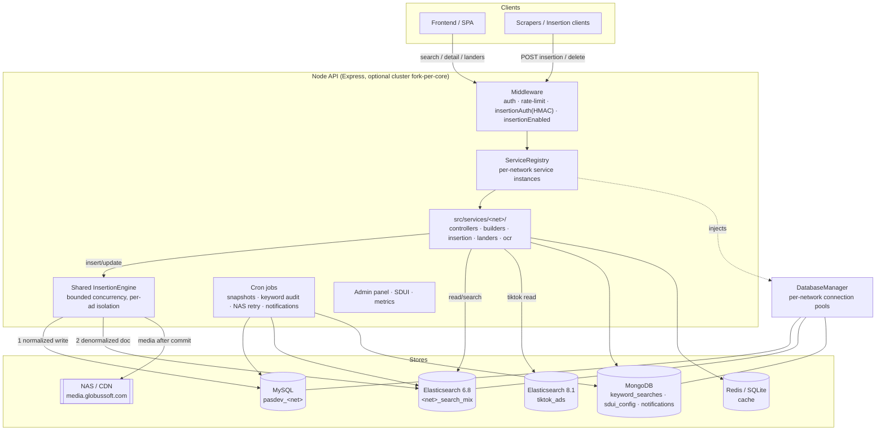
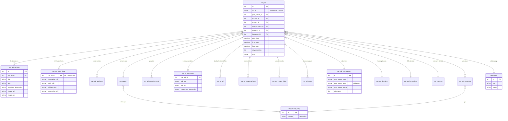
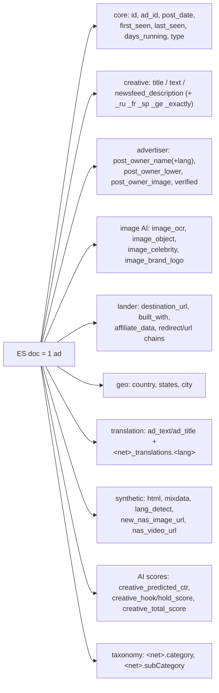

# PowerAdSpy Node API — Data Model & Architecture (Bird's‑Eye View)

> Entity‑Relationship reference for the **SQL** (MySQL) and **Elasticsearch** stores behind the
> PowerAdSpy ad‑intelligence API, plus a high‑level map of how data flows through the system.
>
> This is the **index**. Each ad network has its own full table‑level ERD in a sibling file —
> see [Per‑network ERDs](#per-network-erds). For the runtime/insertion internals see
> [../MANIFEST.md](../MANIFEST.md) and [../KT-INSERTION-PROCESS.md](../KT-INSERTION-PROCESS.md).

---

## 1. What this system is

A multi‑network ad‑spy backend. For each advertising network it **ingests** ads (insertion engine),
**stores** the relational truth in a per‑network MySQL database, **denormalizes** each ad into a
per‑network Elasticsearch index for fast faceted search, and **serves** search/detail/landers/OCR
endpoints to the frontend.

**11 networks:** `facebook`, `instagram`, `gdn`, `youtube`, `google`, `native`, `linkedin`,
`reddit`, `quora`, `pinterest`, `tiktok`.

Every network is **self‑contained** under `src/services/<net>/` and shares only the engine
(`src/insertion/`), middleware, config loader, and `DatabaseManager`.

---

## 2. The two stores per network

| Store | Role | Shape |
|---|---|---|
| **MySQL** (`pasdev_<net>`) | Source of truth, normalized | One main `<net>_ad` table + ~15–25 child/lookup tables (3NF‑ish) |
| **Elasticsearch** (`<net>_search_mix` / `<net>_ads_data`) | Read/search model, denormalized | One big flattened document per ad — a JOIN of the SQL graph, language‑fanned, plus synthetic & AI fields |

The ES document is built per network by `insertion/esDocBuilder.js` from a SQL "joined ad" row
(`repository.getJoinedAd`). **Writes go to MySQL first, then the denormalized doc is pushed to ES.**

---

## 3. Network registry (at a glance)

| Network | MySQL DB | Main table prefix | ES index | ES server | Doc shape | Insertion |
|---|---|---|---|---|---|---|
| Facebook | `pasdev_facebook` | `facebook_ad` | `search_mix` | shared 6.8 | nested (dotted) | ✅ live |
| Instagram | `pasdev_instagram` | `instagram_ad` | `instagram_search_mix` | shared 6.8 | nested (dotted) | ✅ live |
| GDN | `pasdev_gdn` | `gdn_ad` | `gdn_search_mix` *(live: `gdn_search_mix_v2`)* | shared 6.8 | nested (dotted) | ✅ live |
| YouTube | `pasdev_youtube` | `youtube_ad` | `youtube_ads_data` | shared 6.8 | **flat** | ✅ |
| Google (GT) | `pasdev_gtext` | `google_text_ad` | `google_ads_data` | shared 6.8 | **flat** | ✅ |
| Native | `pasdev_native` | `native_ad` | `native_search_mix` *(live: `native_search_mix_v2`)* | shared 6.8 | nested (dotted) | ✅ live |
| LinkedIn | `pasdev_linkedin` | `linkedin_ad` | `linkedin_ads_data` | shared 6.8 | **flat** (epoch dates) | ✅ |
| Reddit | `pasdev_reddit` | `reddit_ad` | `reddit_search_mix` | shared 6.8 | nested (dotted) | ✅ |
| Quora | `pasdev_quora` | `quora_ad` | `quora_search_mix` | shared 6.8 | nested (dotted) | ✅ |
| Pinterest | `pasdev_pinterest` | `pinterest_ad` | `pinterest_search_mix` | shared 6.8 | nested (dotted) | ✅ |
| TikTok | `tiktok_database_development` | *(read‑only)* | `tiktok_ads` | **separate 8.1** | **flat** | ❌ read‑only |

> ES server versions: all networks share the 6.8 cluster **except TikTok**, which is on a separate
> 8.1 cluster (config key `elastic_tiktok`). Index names resolve from
> [config.json](../../config.json) `networks.<net>.elastic.index` via
> [src/config/networks.js](../../src/config/networks.js).

---

## 4. System architecture (bird's‑eye flow)

**Insertion path (per ad):** validate → normalize → `withTransaction` (insert/update the `<net>_ad`
graph) → commit → build denormalized ES doc (`getJoinedAd` → `esDocBuilder`) → index to ES → upload
media to NAS (fire‑and‑forget with a durable retry queue). External calls (translation, impression,
popularity) run in parallel; media moves out of the DB transaction.

**Read path:** controller → `SearchMixQueryBuilder` builds an ES query against `<net>_search_mix`
→ results hydrated → optional MySQL/Mongo enrichment → response.

---

## 5. The canonical SQL model (shared shape)

Every "full" network follows the **same relational pattern** — only the `<net>_` prefix and a few
per‑network tables differ. The generic shape:

**Shared / cross‑network lookup tables** (not prefixed): `languages`, `country_data`
(ISO ↔ name), and for placement‑based networks `target_site` and `networks` (ad‑network
registry used by Native/GDN).

**Per‑network deltas** (why each file is still worth reading):
- **Facebook/Instagram** add `*_meta_ad_budget`, `*_lib_page_details`/`*_page_details`,
  `*_comments`, `*_accounts_activities`, `country` + `country_only`.
- **GDN/Native** add `*_target_site` / `*_ad_target_site`, `*_placement_url`, `networks`,
  and a `phash` near‑duplicate column on the main ad table.
- **YouTube** swaps image for **video** (`video_url`, `thumbnail_url`, `channal_url`, `*_ad_ocb`)
  and uses likes/dislikes/views analytics.
- **Google (GT)** uses `google_text_*` names, `target_keyword`/`target_page` on variants.
- **LinkedIn** splits meta into `*_built_with`, `*_ad_lander`, `*_ocr_ocb_details`, and stores
  `followers` in analytics; **dates are UNIX epoch integers** in ES.
- **Reddit/Quora/Pinterest** carry `*_user`/discoverer columns, `tags`, and Pinterest adds
  platform‑15 targeting (interests, keywords, reach by country).

---

## 6. The Elasticsearch model (shared shape)

Each ad becomes **one denormalized document**. Two flavors exist:

- **Nested‑dotted** (facebook, instagram, gdn, native, reddit, quora, pinterest): keys keep their
  SQL origin as dotted paths, e.g. `facebook_ad_variants.title`, `facebook_ad_post_owners.post_owner_name`.
- **Flat** (youtube, google, linkedin, tiktok): friendly top‑level keys, e.g. `ad_title`, `post_owner`,
  `destination_url`.

**Language fan‑out:** searchable text fields are duplicated with suffixes
`_ru _fr _sp _ge _exactly` (the `_exactly` variant is a non‑analyzed/keyword copy for exact match).
**Synthetic fields:** `html`/`mixdata` (concatenated text for full‑text), `lang_detect`,
`<net>_user_countries`. **AI creative scores** are written later by `creativeScoreController`.
**Category** (`<net>.category` / `<net>.subCategory`) is written by the shared
`addCategoryController` (`newCatInsertion`) — see [../../src/services/common/controllers/addCategoryController.js](../../src/services/common/controllers/addCategoryController.js).

---

## 7. Per‑network ERDs

Each file contains the **full table‑level SQL `erDiagram`** + the **ES field reference** for that network:

| Network | File |
|---|---|
| Facebook | [facebook.md](facebook.md) |
| Instagram | [instagram.md](instagram.md) |
| GDN | [gdn.md](gdn.md) |
| YouTube | [youtube.md](youtube.md) |
| Google (GT) | [google.md](google.md) |
| Native | [native.md](native.md) |
| LinkedIn | [linkedin.md](linkedin.md) |
| Reddit | [reddit.md](reddit.md) |
| Quora | [quora.md](quora.md) |
| Pinterest | [pinterest.md](pinterest.md) |
| TikTok | [tiktok.md](tiktok.md) |

---

## 8. How to read the ERDs

- **PK** = primary key, **FK** = foreign key. `<table>.<col> → <table>.<col>` calls out the reference.
- Relationship crow's‑feet: `||--o{` = one‑to‑many, `||--o|` = one‑to‑one(optional),
  `}o--||` = many‑to‑one.
- Column lists favor **keys + identifying/searchable columns**; exhaustive nullable detail
  lives in the code (`insertion/repository.js` per network is the source of truth for SQL,
  `insertion/esColumns.js` + `esDocBuilder.js` for ES).
- Diagrams render natively on GitHub and in VS Code's Markdown preview (Mermaid).

> **Source of truth:** these diagrams are derived from each network's
> `insertion/repository.js`, `esColumns.js`, `esDocBuilder.js`, `deletePipeline.js`, and read
> controllers. If code and diagram disagree, the code wins — please update the diagram.
