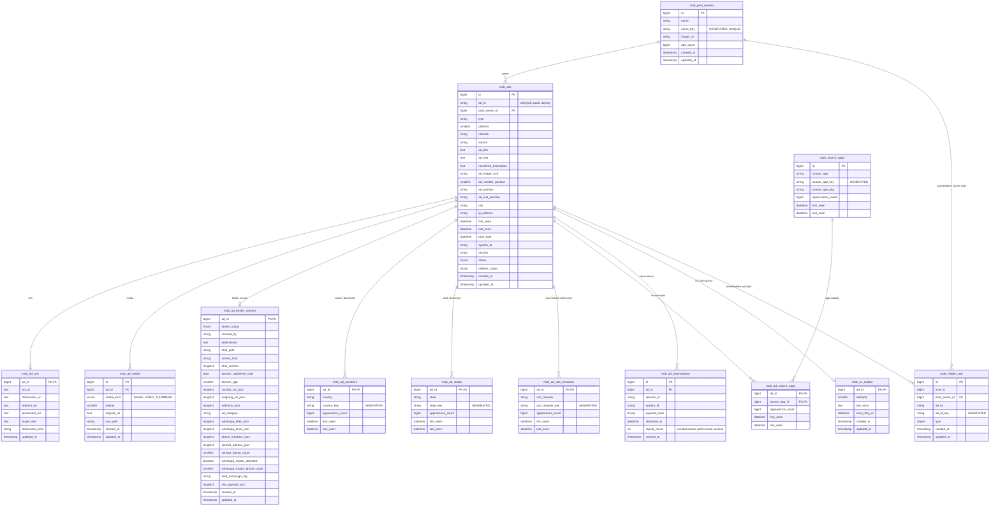

# AdMob - ERD (SQL + Elasticsearch)

[<- back to index](README.md) - MySQL DB `pasdev_admob` - ES index `mob_search_mix`

Source of truth: [scripts/admob/mobdb.schema.sql](../../scripts/admob/mobdb.schema.sql),
[src/services/admob/insertion/repository.js](../../src/services/admob/insertion/repository.js),
[src/services/admob/insertion/esDocBuilder.js](../../src/services/admob/insertion/esDocBuilder.js),
[scripts/admob/mob_search_mix.mapping.json](../../scripts/admob/mob_search_mix.mapping.json).

> **Independent mobile-app ad network.** AdMob does not reuse the Google SQL schema or Google
> Transparency index. SQL stores one main `mob_ads` row per public `ad_id`, then fans out into
> dimensions (`country`, `state`, `sub_network`, `source_app`), URLs, media, retry-safe
> observations, lander-scrape content, and an ES outbox. **ES doc is FLAT** with nested detail
> arrays for dimensions plus a small lander summary.

---

## SQL ERD



**Important constraints**

- `mob_ads.ad_id` is the immutable public ad identity.
- `mob_ads.redirect_status` drives the AdMob lander queue.
- `mob_ad_media` has a unique media slot per `(ad_id, media_kind, ordinal)`.
- `mob_ad_lander_content` has one summary row per ad and keeps the scraped HTML / extraction payload.
- `mob_ad_observations` has a unique retry-safe observation key per `(ad_id, system_id)`.
- `mob_source_apps` deduplicates global apps by `(source_app_key, source_app_pkg)`.
- Per-ad dimensions use generated lowercase keys so matching is case-insensitive.
- `mob_hidden_ads` stores per-user saved / hidden state for AdMob only. The table
  is keyed by user, ad, and type, so the same ad can be hidden and favourited
  independently for different users without touching the AdMob ingestion data.
- `mob_hidden_ads` is not part of `mob_search_mix`; it is consulted only when the
  frontend asks for Saved / Hidden AdMob views.
- `mob_ad_observations` records one AdMob sighting per `(ad_id, session_id)` so
  the backend can count scan-run occurrences and session-level post-owner totals.

---

## Elasticsearch - index `mob_search_mix` (FLAT + nested details)

Document = one ad, flat top-level keys plus nested dimension detail arrays. `_id` = internal
`mob_ads.id`.

| Group | Fields |
|---|---|
| Core | `id`, `ad_id`, `type`, `platform`, `network`, `source`, `status`, `system_id`, `version` |
| Creative | `ad_title`, `ad_text`, `newsfeed_description`, `ad_image_size`, `ad_number_position`, `ad_position`, `ad_sub_position` |
| Owner | `post_owner_id`, `post_owner`, `post_owner_image` |
| Dates | `first_seen`, `last_seen`, `post_date`, `indexed_at` |
| Ranking | `occurrence_count`, `days_running`, `lead_score` |
| URL / lander | `ad_url`, `destination_url`, `redirect_url`, `placement_url`, `target_site`, `destination_host` |
| Media | `image_url_original`, `image_url` |
| Lander scrape | `redirect_status`, `country_iso`, `lander_status`, `lander_crawled_by`, `lander_destination_url`, `lander_html_path`, `lander_screen_shot`, `lander_domain_registered_date`, `lander_domain_age`, `whatsapp_links`, `whatsapp_prefilled_texts`, `phone_numbers`, `contact_buttons`, `contact_button_count`, `whatsapp_rotator_detected`, `whatsapp_rotator_phone_count`, `lead_campaign_tag`, `lander_ad_category` |
| Geo / dimension arrays | `country`, `state`, `sub_network`, `source_app`, `source_app_pkg` |
| Aggregates | `source_app_count` |
| Nested detail arrays | `country_details`, `state_details`, `sub_network_details`, `source_app_details` |

**Nested detail shapes**

- `country_details[]` -> `name`, `appearance_count`, `first_seen`, `last_seen`
- `state_details[]` -> `name`, `appearance_count`, `first_seen`, `last_seen`
- `sub_network_details[]` -> `name`, `appearance_count`, `first_seen`, `last_seen`
- `source_app_details[]` -> `name`, `package`, `appearance_count`, `first_seen`, `last_seen`
- `occurrence_count` -> number of session sightings stored for the poster
- `days_running` -> derived from `last_seen - first_seen + 1`
- `lead_score` -> derived ranking score used for Top Ranked sorting

**Mapping notes**

- Index mapping is `dynamic: "strict"` to catch contract drift early.
- Text search is limited to `post_owner`, `ad_title`, `ad_text`, and `newsfeed_description`.
- Dimension filters are case-insensitive `keyword` fields using the `mob_lowercase` normalizer.
- URL fields and image paths are stored as `keyword` with `index: false`.
- Lander scrape fields are summary-level only; the full HTML and raw extraction payload stay in SQL.
- `ip_address` is typed as Elasticsearch `ip` with `ignore_malformed: true`.

---

## Write flow

```text
payload
  -> validate / normalize
  -> SELECT ... FOR UPDATE on mob_ads by public ad_id
  -> upsert owner
  -> insert/update mob_ads
  -> upsert URLs
  -> upsert IMAGE original_url slot
  -> if lander scrape payload arrives: upsert mob_ad_lander_content and mob_ads.redirect_status
  -> insert observation (retry-safe per ad_id + system_id)
  -> upsert country/state/sub_network rows
  -> upsert source_app master + per-ad source_app pivot
  -> queue mob_es_outbox
  -> commit
  -> upload media to NAS
  -> set mob_ad_media.nas_path
  -> lander scrape flow: build full ES doc with lander summary fields, then index into mob_search_mix
  -> build flat ES doc
  -> index into mob_search_mix
  -> delete outbox row on success / retain for retry on failure
```

This makes MySQL the source of truth while `mob_es_outbox` guarantees Elasticsearch can catch up
after transient indexing failures.

---

## Saved / Hidden state flow

```text
user action (hide / favourite)
  -> insert or delete row in mob_hidden_ads
  -> leave mob_ads untouched
  -> AdMob Saved / Hidden search reads mob_hidden_ads first
  -> matching ad documents are then fetched from mob_search_mix
```

This keeps saved/hidden actions separate from the ingestion pipeline and avoids
reindexing the ad document when a user changes their personal state.
