# Facebook — ERD (SQL + Elasticsearch)

[← back to index](README.md) · MySQL DB `pasdev_facebook` · ES index `search_mix` (shared 6.8 cluster)

Source of truth: [src/services/facebook/insertion/repository.js](../../src/services/facebook/insertion/repository.js),
[esColumns.js](../../src/services/facebook/insertion/esColumns.js),
[esDocBuilder.js](../../src/services/facebook/insertion/esDocBuilder.js).

---

## SQL ERD

```mermaid
erDiagram
    facebook_ad ||--o{ facebook_ad_variants : "creatives"
    facebook_ad ||--o| facebook_ad_meta_data : "1..1"
    facebook_ad ||--o{ facebook_ad_analytics : "daily"
    facebook_ad ||--o{ facebook_ad_countries : "geo"
    facebook_ad ||--o{ facebook_ad_countries_only : "geo"
    facebook_ad ||--o{ facebook_ad_users : "discovery"
    facebook_ad ||--o{ facebook_comments : "comments"
    facebook_ad ||--o| facebook_ad_image_video : "media"
    facebook_ad ||--o| facebook_translation : "translated"
    facebook_ad ||--o| facebook_meta_ad_budget : "budget"
    facebook_ad ||--o| facebook_lib_page_details : "page details"
    facebook_ad }o--|| facebook_ad_post_owners : "advertiser"
    facebook_ad }o--|| facebook_ad_domains : "domain"
    facebook_ad }o--|| facebook_call_to_actions : "CTA"
    facebook_ad }o--|| facebook_category : "category"
    facebook_ad }o--|| country : "primary geo"
    facebook_ad }o--|| facebook_users : "discoverer"
    facebook_ad }o--|| languages : "language"
    country }o--|| country_only : "rolls up"
    facebook_ad_countries }o--|| country : "geo"
    facebook_ad_countries }o--|| country_only : "geo"
    facebook_ad_countries_only }o--|| country_only : "geo"

    facebook_ad {
        int id PK
        string ad_id "platform id"
        int post_owner_id FK
        int domain_id FK
        int call_to_action_id FK
        int category_id FK
        int country_id FK
        int language_id FK
        int discoverer_user_id FK
        int status
        int hits
        datetime post_date
        datetime first_seen
        datetime last_seen
        int days_running
        int likes
        int comments
        int shares
        int impression
        int popularity
        int views
        string type
        string source
    }
    facebook_ad_post_owners {
        int id PK
        string post_owner_name
        string post_owner_lower "GENERATED, dedup"
        string post_owner_image
        string original_post_owner_image
        int ads_count
        int verified
    }
    facebook_ad_variants {
        int id PK
        int facebook_ad_id FK
        string title
        string text
        string newsfeed_description
        string image_url
        string image_url_original
        string image_object
        string image_celebrity
        string image_brand_logo
        string image_ocr
        string tags
    }
    facebook_ad_meta_data {
        int facebook_ad_id PK "FK"
        string destination_url
        string initial_url
        string built_with
        string built_with_analytics_tracking
        string affiliate_data
        datetime firstSeenOnDesktop
        datetime firstSeenOnAndroid
        datetime firstSeenOnIos
        int est_audience_size_low
        int est_audience_size_high
        string meta_ad_url
        string ad_run_platforms
        string screenshot_url
        string blackhat_path
    }
    facebook_ad_analytics {
        int id PK
        int facebook_ad_id FK
        int likes
        int comments
        int shares
        int popularity
        int impression
        float engagement_rate
        date date
        int hits
    }
    facebook_translation {
        int facebook_ad_id PK "FK"
        string ad_title
        string ad_text
        string news_feed_description
    }
    facebook_meta_ad_budget {
        int facebook_ad_id PK "FK"
        string meta_ad_id "unique"
        int lowerBudget
        int upperBudget
    }
    facebook_lib_page_details {
        int id PK
        int facebook_ad_id FK
        string ad_id
        int impression_low
        int impression_high
        string gender_details
        string age_details
        string page_category
    }
    facebook_ad_image_video {
        int facebook_ad_id PK "FK"
        string ad_type
        string ad_image_video
    }
    facebook_ad_countries {
        int id PK
        int facebook_ad_id FK
        int country_id FK
        int country_only_id FK
        int count
    }
    facebook_ad_countries_only {
        int id PK
        int facebook_ad_id FK
        int country_only_id FK
        int count
    }
    facebook_ad_users {
        int id PK
        int facebook_ad_id FK
        int user_id
        int count
        int platform
        int userid_status
    }
    facebook_comments {
        int id PK
        int facebook_ad_id FK
        json comment_data
    }
    facebook_call_to_actions {
        int id PK
        string action "unique"
        int count
    }
    facebook_category {
        int id PK
        string category_name "unique"
    }
    facebook_ad_domains {
        int id PK
        string domain "unique"
        date domain_registered_date
    }
    facebook_users {
        int id PK
        string facebook_id "unique"
        string Gender
        int ads_info_status
        string current_country
    }
    country {
        int id PK
        string city
        string state
        string country
        int country_only_id FK
    }
    country_only {
        int id PK
        string country "unique"
    }
    languages {
        int id PK
        string iso "unique"
        string name
    }
```

**Also present** (lookup / side tables not drawn above): `facebook_ad_outgoing_links`,
`facebook_ad_url`, `facebook_html_content`, `facebook_ad_bug_report`,
`facebook_accounts_activities` (platform‑10 tracking), `country_data` (ISO↔name),
`hidden_ads` (user_id, ad_id, type 1=advertiser/2=ad/3=favorite), `Users_Request` (sync tracking).

---

## Elasticsearch — index `search_mix`

Document = one ad, **nested‑dotted** keys (SQL origin preserved). `_id` = internal `facebook_ad.id`.

| Group | Fields |
|---|---|
| Core | `facebook_ad.id`, `discoverer_user_id`, `platform`, `status`, `hits`, `post_date`, `last_seen`, `first_seen`, `lower_age_seen`, `days_running`, `likes`, `comments`, `shares`, `created_date`, `ad_position`, `type`, `impression`, `popularity`, `views`, `source` |
| Creative (variants) | `facebook_ad_variants.title`, `.text`, `.newsfeed_description`, `.image_object`, `.image_celebrity`, `.image_brand_logo`, `.image_ocr`, `.image_url`, `.image_url_original`, `.tags` — **each searchable text fanned to** `_ru _fr _sp _ge _exactly` |
| Advertiser | `facebook_ad_post_owners.post_owner_name` (+lang fan‑out), `.post_owner_lower`, `.verified`, `.page_created_date`, `.post_owner_image` |
| CTA / category / lang | `facebook_call_to_actions.action`, `facebook.category`, `facebook.subCategory`, `facebook.averagebudget`, `languages.iso`, `languages.name`, `lang_detect` |
| Lander / meta | `facebook_ad_meta_data.destination_url`, `.initial_url`, `.built_with`, `.built_with_analytics_tracking`, `.affiliate_data`, `.firstSeenOnDesktop/Android/Ios`, `.est_audience_size_low/high`, `.EUT`, `.meta_ad_url`, `.ad_run_platforms`, `.ad_url`, `facebook_ad_domains.domain`, `.domain_registered_date` |
| URLs | `facebook_ad_url.url`, `.url_destination`, `.url_redirects`, `.country_code`, `facebook_ad_outgoing_links.source_url`, `.redirect_url`, `.final_url` |
| Geo | `country_only.country`, `facebook_user_countries` (synthetic array), `facebook_users.Gender` |
| Budget / lib page | `facebook_meta_ad_budget.lowerBudget`, `.upperBudget`, `facebook_lib_page_details.impression_low/high`, `.gender_details`, `.age_details`, `.page_category` |
| Translation | `facebook_translations.ad_text`, `.ad_title`, `.news_feed_description`, `.ar/.pt/.fr` (per‑language) |
| Targeting | `behaviors`, `interests`, `confidence_score` |
| Media (post‑commit) | `facebook_ad_image_video.ad_image_video`, `new_nas_image_url`, `nas_video_url` |
| Synthetic | `html` (title+text+newsfeed), `mixdata` (+comment_data), `comment_data` (parsed JSON) |
| AI creative scores | `creative_predicted_ctr`, `creative_hook_score`, `creative_hold_score`, `creative_hook_total`, `creative_hold_total`, `creative_total_score`, `creative_score_rationale`, `creative_scored_at`, `creative_scored_by` |
