# GDN (Google Display Network) — ERD (SQL + Elasticsearch)

[← back to index](README.md) · MySQL DB `pasdev_gdn` · ES index `gdn_search_mix` *(live client uses `gdn_search_mix_v2`)* · shared 6.8

Source of truth: [src/services/gdn/insertion/repository.js](../../src/services/gdn/insertion/repository.js),
[esColumns.js](../../src/services/gdn/insertion/esColumns.js),
[esDocBuilder.js](../../src/services/gdn/insertion/esDocBuilder.js).

> Display‑network shape: **placement/target‑site** tables instead of comments/budget, a `phash`
> near‑duplicate column on `gdn_ad`, and `ad_image_size` → synthetic `height`/`width` in ES.

---

## SQL ERD

```mermaid
erDiagram
    gdn_ad ||--o{ gdn_ad_variants : "creatives"
    gdn_ad ||--o| gdn_ad_meta_data : "1..1"
    gdn_ad ||--o| gdn_ad_translation : "translated"
    gdn_ad ||--o{ gdn_ad_countries : "geo"
    gdn_ad ||--o{ gdn_ad_countries_only : "geo"
    gdn_ad ||--o{ gdn_ad_url : "urls"
    gdn_ad ||--o{ gdn_ad_outgoing_links : "redirects"
    gdn_ad ||--o{ gdn_ad_target_site : "placements"
    gdn_ad ||--o{ gdn_placement_url : "placement urls"
    gdn_ad ||--o| gdn_ad_html_lander_content : "lander html"
    gdn_ad }o--|| gdn_ad_post_owners : "advertiser"
    gdn_ad }o--|| gdn_ad_domains : "domain"
    gdn_ad }o--|| gdn_country : "primary geo"
    gdn_ad }o--|| gdn_target_site : "default site"
    gdn_ad }o--|| languages : "language"
    gdn_country }o--|| gdn_country_only : "rolls up"
    gdn_ad_countries }o--|| gdn_country : "geo"
    gdn_ad_countries }o--|| gdn_country_only : "geo"
    gdn_ad_countries_only }o--|| gdn_country_only : "geo"
    gdn_ad_target_site }o--|| gdn_target_site : "site"

    gdn_ad {
        int id PK
        string ad_id "SHA-256"
        bigint phash "near-dup hash"
        int post_owner_id FK
        int country_only_id FK
        int country_id FK
        int domain_id FK
        int target_site_id FK
        int language_id FK
        string source
        string type
        int ad_position
        int ad_sub_position
        datetime post_date
        datetime first_seen
        datetime last_seen
        int days_running
        int hits
    }
    gdn_ad_post_owners {
        int id PK
        string post_owner_name "unique on LOWER()"
        string post_owner_lower
        string post_owner_image
        int ads_count
    }
    gdn_ad_variants {
        int id PK
        int gdn_ad_id FK
        string title
        string text
        string newsfeed_description
        string ad_image_size "W*H"
        string image_object
        string image_celebrity
        string image_brand_logo
        string image_ocr
        string image_url
        string image_url_original
    }
    gdn_ad_meta_data {
        int gdn_ad_id PK "FK"
        string affiliate_data
        string destination_url
        string redirect_url
        string ad_url
        datetime firstSeenOnDesktop
        datetime lastSeenOnDesktop
        string built_with
        string built_with_analytics_tracking
        string platform
        string screenshot_url
        string blackhat_path
        int version
    }
    gdn_ad_translation {
        int gdn_ad_id PK "FK"
        string ad_text
        string ad_title
        string news_feed_description
    }
    gdn_ad_url {
        int id PK
        int gdn_ad_id FK
        string url_type "D/R"
        string url
        string url_destination
        string url_redirects
        int proxy_lander_status
    }
    gdn_ad_outgoing_links {
        int id PK
        int gdn_ad_id FK
        string source_url
        string redirect_url
        string final_url
        string country_code
    }
    gdn_ad_target_site {
        int id PK
        int gdn_ad_id FK
        int target_site_id FK
        int count
        date date
        datetime created_date
    }
    gdn_target_site {
        int id PK
        string target_site
    }
    gdn_placement_url {
        int id PK
        int gdn_ad_id FK
        string placement_url
        int count
        datetime created_date
    }
    gdn_ad_countries {
        int id PK
        int gdn_ad_id FK
        int country_id FK
        int country_only_id FK
        int count
    }
    gdn_ad_countries_only {
        int id PK
        int gdn_ad_id FK
        int country_only_id FK
        int count
        string ip_address
    }
    gdn_country {
        int id PK
        string city
        string state
        string country
        int country_only_id FK
        int status
    }
    gdn_country_only {
        int id PK
        string country
    }
    gdn_ad_domains {
        int id PK
        string domain
        date domain_registered_date
    }
    languages {
        int id PK
        string iso
        string name
    }
```

**Also present:** `gdn_ad_html_lander_content`, `gdn_ad_users` / `gdn_account_activities`
(gtext/platform‑12 tracking), `gdn_hidden_ads` (type 1/2/3), `country_data` (ISO↔nicename).

---

## Elasticsearch — index `gdn_search_mix` / `gdn_search_mix_v2`

Document = one ad, **nested‑dotted** keys. `_id` = internal `gdn_ad.id`.

| Group | Fields |
|---|---|
| Core | `gdn_ad.id`, `source`, `post_date`, `last_seen`, `first_seen`, `days_running`, `ad_position`, `ad_sub_position`, `type`, `hits` |
| Creative | `gdn_ad_variants.title`, `.text`, `.newsfeed_description`, `.image_object`, `.image_celebrity`, `.image_brand_logo`, `.image_ocr` — fanned `_ru _fr _sp _ge _exactly`; plus `.ad_image_size` → synthetic **`height`**, **`width`** |
| Advertiser | `gdn_ad_post_owners.post_owner_name` (+lang), `.post_owner_lower`, `.post_owner_image` |
| Geo / lang / taxonomy | `gdn_country_only.country`, `lang_detect`, `gdn.category`, `gdn.subCategory` |
| Lander / meta | `gdn_ad_meta_data.affiliate_data`, `.destination_url`, `.redirect_url`, `.ad_url`, `.firstSeenOnDesktop`, `.built_with`, `.built_with_analytics_tracking`, `.platform`, `gdn_ad_domains.domain_registered_date` |
| Placement | `gdn_placement_url.placement_url`, `target_site.target_site` (aliased from `gdn_target_site`) |
| URLs | `gdn_ad_url.url`, `.url_destination`, `.url_redirects`, `gdn_ad_outgoing_links.source_url`, `.redirect_url`, `.final_url` |
| Translation | `gdn_ad_translation.ad_text`, `.ad_title`, `.news_feed_description` |
| Media (post‑commit) | `new_nas_image_url`, `image_url_original` |
| AI creative scores | `creative_predicted_ctr`, `creative_hook_score`, `creative_hold_score`, `creative_hook_total`, `creative_hold_total`, `creative_total_score`, `creative_score_rationale`, `creative_scored_at`, `creative_scored_by` |
