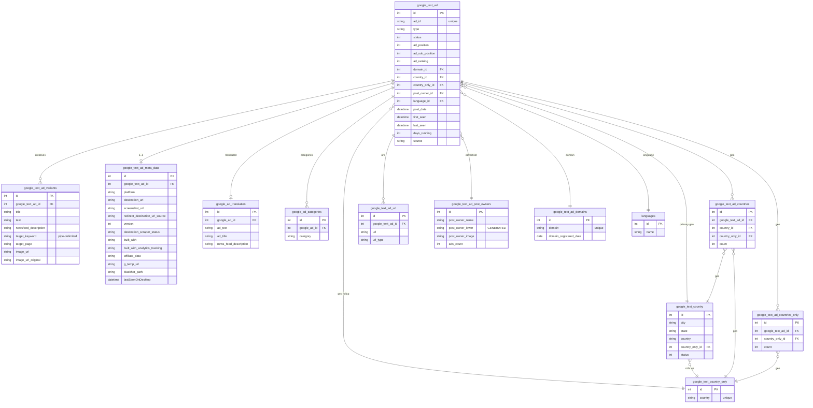

# Google Text Ads (GT) — ERD (SQL + Elasticsearch)

[← back to index](README.md) · MySQL DB `pasdev_gtext` · ES index `google_ads_data` (shared 6.8)

Source of truth: [src/services/google/insertion/repository.js](../../src/services/google/insertion/repository.js),
[esColumns.js](../../src/services/google/insertion/esColumns.js),
[esDocBuilder.js](../../src/services/google/insertion/esDocBuilder.js).

> **Search/text ads.** Tables are prefixed `google_text_*` (translation/categories use `google_*`).
> Variants carry `target_keyword` (pipe‑delimited) + `target_page`. **ES doc is FLAT.**

---

## SQL ERD

**Also present:** `google_text_hidden_ads` (type 1/2/3), `google_text_html_content`,
`google_text_user_affiliate_ads`, `google_text_outgoing_url`,
`gtext_ad_users` / `google_accout_activities` (platform‑10 tracking).

---

## Elasticsearch — index `google_ads_data` (FLAT)

Document = one ad, **flat** keys. `_id` = internal id (`ad_id` mirrors it for compatibility).

| Group | Fields |
|---|---|
| Core | `id`, `ad_id`, `post_date`, `first_seen`, `last_seen`, `source`, `status`, `days_running`, `ad_ranking`, `ad_position`, `ad_sub_position`, `type` |
| Creative | `title`, `text`, `newsfeed_description`, `target_keyword` (array, split on `|`), `target_page`, `image_url` |
| Advertiser / domain | `post_owner_name`, `post_owner_image`, `post_owner_lower`, `domain`, `domain_registered_date`, `url` |
| Lander / meta | `destination_url`, `firstSeenOnDesktop/Android/Ios`, `built_with` *(edge_ngram)*, `built_with_analytics_tracking` *(edge_ngram)*, `affiliate_data`, `g_temp_url`, `blackhat_path`, `destination_scraper_status`, `platform`, `version`, `png_file`, `redirect_destination_url_source`, `screenshot_url`, `clickbank_processed_date` |
| Translation | `ad_text`, `ad_title`, `news_feed_description`, `google_translation.<lang>` (nested per language) |
| URLs | `redirect_url`, `source_url`, `url_destination`, `final_url`, `url_redirects` |
| Geo | `country` (string/array), `state`, `city` |
| Lander HTML | `html_whitehat_lander_text`, `html_res_blackhat_lander_text`, `html_dc_blackhat_lander_text` |
| Image AI | `image_brand`, `image_object`, `image_celebrity`, `image_ocr`, `new_nas_image_url` |
| Engagement / taxonomy | `likes`, `comments`, `dislikes`, `views`, `category`, `subCategory`, `lang_detect` |

> Date fields coerce MySQL datetimes to `yyyy-MM-dd HH:mm:ss` (domain date → `yyyy-MM-dd`); the
> `0000-00-00 00:00:00` sentinel maps to `0001-01-01 01:01:01`.
