# Instagram — ERD (SQL + Elasticsearch)

[← back to index](README.md) · MySQL DB `pasdev_instagram` · ES index `instagram_search_mix` (shared 6.8)

Source of truth: [src/services/instagram/insertion/repository.js](../../src/services/instagram/insertion/repository.js),
[esColumns.js](../../src/services/instagram/insertion/esColumns.js),
[esDocBuilder.js](../../src/services/instagram/insertion/esDocBuilder.js).

> Near‑identical to Facebook. Notable deltas: CTA table is singular `instagram_call_to_action`,
> meta‑audience split into `instagram_ad_cost_usage_benefit_analysis`, `instagram_ad` carries
> `default_analytics_id`, `ad_type`, `collation_id`, and there is an `instagram_ad_html_lander_content`.

---

## SQL ERD

```mermaid
erDiagram
    instagram_ad ||--o{ instagram_ad_variants : "creatives"
    instagram_ad ||--o{ instagram_ad_meta_data : "meta"
    instagram_ad ||--o{ instagram_ad_analytics : "daily"
    instagram_ad ||--o{ instagram_ad_countries : "geo"
    instagram_ad ||--o{ instagram_ad_countries_only : "geo"
    instagram_ad ||--o{ instagram_ad_users : "discovery"
    instagram_ad ||--o{ instagram_comments : "comments"
    instagram_ad ||--o| instagram_ad_image_video : "media"
    instagram_ad ||--o| instagram_ad_translation : "translated"
    instagram_ad ||--o| instagram_meta_ad_budget : "budget"
    instagram_ad ||--o| instagram_ad_cost_usage_benefit_analysis : "audience"
    instagram_ad ||--o| instagram_page_details : "page details"
    instagram_ad ||--o| instagram_ad_html_lander_content : "lander html"
    instagram_ad ||--o{ instagram_ad_url : "urls"
    instagram_ad ||--o{ instagram_ad_outgoing_links : "redirects"
    instagram_ad }o--|| instagram_ad_post_owners : "advertiser"
    instagram_ad }o--|| instagram_ad_domain : "domain"
    instagram_ad }o--|| instagram_call_to_action : "CTA"
    instagram_ad }o--|| instagram_category : "category"
    instagram_ad }o--|| instagram_country : "primary geo"
    instagram_ad }o--|| instagram_user : "discoverer"
    instagram_ad }o--|| languages : "language"
    instagram_country }o--|| instagram_country_only : "rolls up"
    instagram_ad_countries }o--|| instagram_country_only : "geo"
    instagram_ad_countries_only }o--|| instagram_country_only : "geo"

    instagram_ad {
        int id PK
        string ad_id
        int post_owner_id FK
        int call_to_action_id FK
        int country_id FK
        int discoverer_user_id FK
        int domain_id FK
        int category_id FK
        int language_id FK
        int default_analytics_id FK
        int status
        datetime post_date
        datetime first_seen
        datetime last_seen
        int days_running
        int likes
        int comments
        int shares
        int impression
        int popularity
        int views
        int hits
        string type
        string ad_type
        int collation_id
        string source
    }
    instagram_ad_post_owners {
        int id PK
        string post_owner_name
        string post_owner_lower
        string post_owner_image
        string original_post_owner_image
        int ads_count
        int verified
        date page_created_date
    }
    instagram_ad_variants {
        int id PK
        int instagram_ad_id FK
        string title
        string text
        string newsfeed_description
        string image_url
        string image_url_original
        string image_object
        string image_celebrity
        string image_brand_logo
        string image_ocr
    }
    instagram_ad_meta_data {
        int id PK
        int instagram_ad_id FK
        string destination_url
        string built_with
        string built_with_analytics_tracking
        string affiliate_data
        datetime firstSeenOnDesktop
        datetime firstSeenOnAndroid
        datetime firstSeenOnIos
        string platform
        string ad_url
        string screenshot_url
        string blackhat_path
    }
    instagram_ad_cost_usage_benefit_analysis {
        int id PK
        int instagram_ad_id FK
        int est_audience_size_low
        int est_audience_size_high
        string EUT
        string meta_ad_url
        string ad_run_platforms
    }
    instagram_ad_analytics {
        int id PK
        int instagram_ad_id FK
        int likes
        int comments
        int shares
        int popularity
        int impression
        float engagement_rate
        date date
        int hits
        string initial_url
    }
    instagram_ad_translation {
        int id PK
        int instagram_ad_id FK
        string ad_title
        string ad_text
        string news_feed_description
    }
    instagram_meta_ad_budget {
        int id PK
        int instagram_ad_id FK
        string meta_ad_id
        int lowerBudget
        int upperBudget
    }
    instagram_ad_image_video {
        int id PK
        int instagram_ad_id FK
        string ad_type
        string ad_image_video
    }
    instagram_ad_html_lander_content {
        int id PK
        int instagram_ad_id FK
        string html_whitehat_lander_text
        string html_res_blackhat_lander_text
        string html_dc_blackhat_lander_text
    }
    instagram_page_details {
        int id PK
        int instagram_ad_id FK
        string ad_id
        int impression_low
        int impression_high
    }
    instagram_ad_url {
        int id PK
        int instagram_ad_id FK
        string url
        string country_code
        string url_destination
        string url_redirects
    }
    instagram_ad_outgoing_links {
        int id PK
        int instagram_ad_id FK
        string source_url
        string redirect_url
        string final_url
    }
    instagram_ad_countries {
        int id PK
        int instagram_ad_id FK
        int country_id FK
        int country_only_id FK
        int count
    }
    instagram_ad_countries_only {
        int id PK
        int instagram_ad_id FK
        int country_only_id FK
        int count
    }
    instagram_ad_users {
        int id PK
        int instagram_ad_id FK
        int user_id
        int count
        int userid_status
    }
    instagram_comments {
        int id PK
        int instagram_ad_id FK
        json comment_data
    }
    instagram_call_to_action {
        int id PK
        string call_to_action
        int count
    }
    instagram_category {
        int id PK
        string category_name
    }
    instagram_ad_domain {
        int id PK
        string domain
        date domain_registered_date
    }
    instagram_user {
        int id PK
        string instagram_id
        string gender
        string current_country
    }
    instagram_country {
        int id PK
        string city
        string state
        string country
        int country_only_id FK
    }
    instagram_country_only {
        int id PK
        string country
    }
    languages {
        int id PK
        string iso
        string name
    }
```

**Also present:** `instagram_hidden_ads` (ad_id, user_id, type, post_owner_id),
`instagram_ad_bug_report`, `instagram_accounts_activities` (platform tracking),
`instagram_user_affiliate_ads`.

---

## Elasticsearch — index `instagram_search_mix`

Document = one ad, **nested‑dotted** keys. `_id` = internal `instagram_ad.id`.

| Group | Fields |
|---|---|
| Core | `instagram_ad.id`, `status`, `post_date`, `last_seen`, `lower_age_seen`, `days_running`, `likes`, `comments`, `shares`, `created_date`, `ad_position`, `type`, `collation_id`, `hits`, `first_seen`, `impression`, `popularity`, `views` |
| Creative | `instagram_ad_variants.title`, `.text`, `.newsfeed_description`, `.image_object`, `.image_celebrity`, `.image_brand_logo`, `.image_ocr` — fanned `_ru _fr _sp _ge _exactly` |
| Advertiser | `instagram_ad_post_owners.post_owner_name` (+lang), `.post_owner_lower`, `.verified`, `.page_created_date` |
| CTA / geo / lang | `instagram_call_to_action.call_to_action`, `instagram_country_only.country`, `instagram_user.gender`, `instagram_user_countries` (synthetic), `languages.iso`, `.name`, `lang_detect` |
| Lander / meta | `instagram_ad_meta_data.destination_url`, `.initial_url`, `.firstSeenOnDesktop/Android/Ios`, `.platform`, `.built_with`, `.built_with_analytics_tracking`, `.affiliate_data`, `instagram_ad_domain.domain`, `.domain_registered_date` |
| Audience | `instagram_ad_cost_usage_benefit_analysis.est_audience_size_low/high`, `.EUT`, `.meta_ad_url`, `.ad_run_platforms` |
| URLs | `instagram_ad_url.url`, `.url_redirects`, `.url_destination`, `.country_code`, `instagram_ad_outgoing_links.source_url`, `.redirect_url`, `.final_url` |
| Translation / lander | `instagram_ad_translation.ad_text`, `.ad_title`, `.news_feed_description`, `instagram_ad_html_lander_content.html_whitehat_lander_text`, `.html_res_blackhat_lander_text`, `.html_dc_blackhat_lander_text` |
| Media (post‑commit) | `instagram_ad_image_video.ad_image_video`, `new_nas_image_url`, `nas_video_url` |
| Synthetic | `html`, `mixdata`, `comment_data` (parsed) |
