# LinkedIn — ERD (SQL + Elasticsearch)

[← back to index](README.md) · MySQL DB `pasdev_linkedin` · ES index `linkedin_ads_data` (shared 6.8)

Source of truth: [src/services/linkedin/insertion/repository.js](../../src/services/linkedin/insertion/repository.js),
[esColumns.js](../../src/services/linkedin/insertion/esColumns.js),
[esDocBuilder.js](../../src/services/linkedin/insertion/esDocBuilder.js).

> Meta is **split** into `linkedin_ad_built_with`, `linkedin_ad_lander`, and image AI into
> `linkedin_ad_ocr_ocb_details`. Analytics track `followers`. **ES doc is FLAT and all date
> fields are UNIX epoch integers** (`toEpoch()` in esDocBuilder).

---

## SQL ERD

```mermaid
erDiagram
    linkedin_ad ||--o{ linkedin_ad_variants : "creatives"
    linkedin_ad ||--o| linkedin_ad_meta_data : "meta"
    linkedin_ad ||--o| linkedin_ad_built_with : "tech stack"
    linkedin_ad ||--o| linkedin_ad_lander : "lander assets"
    linkedin_ad ||--o| linkedin_ad_ocr_ocb_details : "image AI"
    linkedin_ad ||--o{ linkedin_ad_analytics : "daily"
    linkedin_ad ||--o| linkedin_ad_image_video : "media"
    linkedin_ad ||--o| linkedin_ad_html_lander_content : "lander html"
    linkedin_ad ||--o{ linkedin_ad_countries_only : "geo"
    linkedin_ad ||--o{ linkedin_ad_url : "urls"
    linkedin_ad ||--o{ linkedin_ad_outgoing_links : "redirects"
    linkedin_ad ||--o{ linkedin_ad_comments : "comments"
    linkedin_ad ||--o{ linkedin_ad_users : "discovery"
    linkedin_ad ||--o{ linkedin_ad_categories : "categories"
    linkedin_ad }o--|| linkedin_ad_post_owners : "advertiser"
    linkedin_ad }o--|| linkedin_call_to_actions : "CTA"
    linkedin_ad }o--|| linkedin_ad_domains : "domain"
    linkedin_ad }o--|| linkedin_country : "primary geo"
    linkedin_ad }o--|| country_only : "geo rollup"
    linkedin_ad }o--|| languages : "language"
    linkedin_ad_countries_only }o--|| country_only : "geo"

    linkedin_ad {
        int id PK
        string ad_id "unique"
        string type
        string ad_position
        int post_date "epoch"
        int first_seen "epoch"
        int last_seen "epoch"
        int days_running
        int post_owner_id FK
        int call_to_action_id FK
        int country_only_id FK
        int language_id FK
        int domain_id FK
        int country_id FK
    }
    linkedin_ad_post_owners {
        int id PK
        string post_owner_name "dedup (ci)"
        string post_owner_image
        string original_post_owner_image
        int ads_count
        int verified
    }
    linkedin_ad_variants {
        int id PK
        int linkedin_ad_id FK
        string title
        string text
        string newsfeed_description
        string image_url
        string image_url_original
    }
    linkedin_ad_meta_data {
        int id PK
        int linkedin_ad_id FK
        string ad_url
        string destination_url
        string platform
        int firstSeenOnDesktop
        string screenshot_url
    }
    linkedin_ad_built_with {
        int id PK
        int linkedin_ad_id FK
        string built_with
        string built_with_analytics_tracking
        string affiliate_data
    }
    linkedin_ad_lander {
        int id PK
        int linkedin_ad_id FK
        string png_file
        string blackhat_path
        string white_ad_screenshot
        string white_ad_lander
    }
    linkedin_ad_ocr_ocb_details {
        int id PK
        int linkedin_ad_id FK
        string image_ocr
        string image_object
        string image_brand_logo
        string image_celebrity
    }
    linkedin_ad_analytics {
        int id PK
        int linkedin_ad_id FK
        int likes
        int comments
        int followers
        int hits
        datetime date
        datetime created
    }
    linkedin_ad_image_video {
        int id PK
        int linkedin_ad_id FK
        string ad_type
        string ad_image_video
    }
    linkedin_ad_url {
        int id PK
        int linkedin_ad_id FK
        string url
        string url_type
        string country_code
    }
    linkedin_ad_outgoing_links {
        int id PK
        int linkedin_ad_id FK
        int proxy_lander_status
    }
    linkedin_ad_comments {
        int id PK
        int linkedin_ad_id FK
        json comment_data
    }
    linkedin_ad_users {
        int id PK
        int linkedin_ad_id FK
        int user_id
        int count
        int platform
    }
    linkedin_ad_html_lander_content {
        int id PK
        int linkedin_ad_id FK
        string html_whitehat_lander_text
    }
    linkedin_call_to_actions {
        int id PK
        string action
        int count
    }
    linkedin_ad_domains {
        int id PK
        string domain
        int domain_registered_date "epoch"
    }
    linkedin_country {
        int id PK
        string city
        string state
        string country
    }
    country_only {
        int id PK
        string country
    }
    languages {
        int id PK
        string iso
        string name
    }
```

**Also present:** `linkedin_ad_categories`, `linkedin_ad_bug_report` (keyed by `ad_id`),
`linkedin_account_activities` (platform‑10 tracking), `linkedin_users` (discoverer).

---

## Elasticsearch — index `linkedin_ads_data` (FLAT, epoch dates)

Document = one ad, **flat** keys. `_id` = internal `linkedin_ad.id`. `first_seen`/`last_seen`/`post_date`/`domain_registration_date` are **UNIX epoch ints**.

| Group | Fields |
|---|---|
| Core | `ad_id`, `post_date`, `first_seen`, `last_seen`, `ad_type`, `ad_position`, `ad_language`, `duration`, `source` (array) |
| Creative | `ad_title`, `ad_text`, `newsfeed_description`, `html_text` |
| Advertiser | `post_owner`, `post_owner_id`, `post_owner_image`, `verified` |
| Media | `ad_image`, `ad_video`, `ad_image_or_video`, `Thumbnail`, `image_url_original`, `new_nas_image_url`, `call_to_action` |
| Image AI | `image_ocr`, `image_object` (array), `image_brand` (array), `image_celebrity` (array) |
| Engagement | `reactions` *(object `{likes}`)*, `comments`, `impression`, `popularity`, `impression_low`, `impression_high` |
| Lander / meta | `destination_url`, `platform`, `redirect_urls` (array), `affiliate_networks`, `ecommerce_platform`, `funnel`, `domain_registration_date` |
| Geo | `countries` (array), `state`, `city` |
| Translation / taxonomy | `linkedin_translation.<lang>`, `linkedin.category`, `linkedin.subCategory` |
