# Native — ERD (SQL + Elasticsearch)

[← back to index](README.md) · MySQL DB `pasdev_native` · ES index `native_search_mix` *(live client uses `native_search_mix_v2`)* · shared 6.8

Source of truth: [src/services/native/insertion/repository.js](../../src/services/native/insertion/repository.js),
[esColumns.js](../../src/services/native/insertion/esColumns.js),
[esDocBuilder.js](../../src/services/native/insertion/esDocBuilder.js).

> Native‑ad network (Taboola/Outbrain‑style). Has an **ad‑network registry** (`networks`),
> **placement/target‑site** tables, and a `phash` near‑duplicate column.

---

## SQL ERD

```mermaid
erDiagram
    native_ad ||--o{ native_ad_variants : "creatives"
    native_ad ||--o{ native_ad_meta_data : "meta"
    native_ad ||--o| native_ad_translation : "translated"
    native_ad ||--o{ native_ad_countries : "geo"
    native_ad ||--o{ native_ad_countries_only : "geo"
    native_ad ||--o{ native_ad_url : "urls"
    native_ad ||--o{ native_ad_outgoing_links : "redirects"
    native_ad ||--o{ native_ad_target_site : "placements"
    native_ad ||--o{ native_placement_url : "placement urls"
    native_ad ||--o{ native_ad_network : "ad networks"
    native_ad }o--|| native_ad_post_owners : "advertiser"
    native_ad }o--|| native_ad_domains : "domain"
    native_ad }o--|| native_country : "primary geo"
    native_ad }o--|| target_site : "default site"
    native_ad }o--|| networks : "default network"
    native_ad }o--|| languages : "language"
    native_country }o--|| native_country_only : "rolls up"
    native_ad_countries }o--|| native_country : "geo"
    native_ad_countries }o--|| native_country_only : "geo"
    native_ad_countries_only }o--|| native_country_only : "geo"
    native_ad_target_site }o--|| target_site : "site"
    native_ad_network }o--|| networks : "network"

    native_ad {
        int id PK
        string ad_id "MD5"
        bigint phash "near-dup hash"
        int domain_id FK
        int country_id FK
        int country_only_id FK
        int post_owner_id FK
        int language_id FK
        int network_id FK
        int target_site_id FK
        int system_id
        string source
        datetime post_date
        datetime first_seen
        datetime last_seen
        int days_running
        int ad_position
        int ad_sub_position
        string type
    }
    native_ad_post_owners {
        int id PK
        string post_owner_name
        string post_owner_lower
        string post_owner_image
        int ads_count
        int image_updated
    }
    native_ad_variants {
        int id PK
        int native_ad_id FK
        string title
        string text
        string newsfeed_description
        string image_url
        string image_url_original
        string image_object
        string image_celebrity
        string image_brand_logo
        string image_ocr
    }
    native_ad_meta_data {
        int id PK
        int native_ad_id FK
        string platform
        string version
        string destination_url
        string redirect_url
        string ad_url
        string tracker_url
        string screenshot_url
        datetime firstSeenOnDesktop
        datetime lastSeenOnDesktop
        string built_with
        string built_with_analytics_tracking
        string affiliate_data
    }
    native_ad_translation {
        int id PK
        int native_ad_id FK
        string ad_text
        string ad_title
        string news_feed_description
    }
    native_ad_url {
        int id PK
        int native_ad_id FK
        string url
        string country_code
        string url_destination
        string url_redirects
    }
    native_ad_outgoing_links {
        int id PK
        int native_ad_id FK
        string source_url
        string redirect_url
        string final_url
    }
    native_ad_target_site {
        int id PK
        int native_ad_id FK
        int target_site_id FK
        int count
        date date
        datetime created_date
    }
    target_site {
        int id PK
        string target_site "unique"
    }
    native_placement_url {
        int id PK
        int native_ad_id FK
        string placement_url
        int count
        datetime created_date
    }
    native_ad_network {
        int id PK
        int native_ad_id FK
        int network_id FK
        int count
        datetime created_date
    }
    networks {
        int id PK
        string network "unique"
    }
    native_ad_countries {
        int id PK
        int native_ad_id FK
        int country_id FK
        int country_only_id FK
        int count
    }
    native_ad_countries_only {
        int id PK
        int native_ad_id FK
        int country_only_id FK
        int count
        string ip_address
    }
    native_country {
        int id PK
        string city
        string state
        string country
        int country_only_id FK
        int status
    }
    native_country_only {
        int id PK
        string country "unique"
    }
    native_ad_domains {
        int id PK
        string domain "unique"
        date domain_registered_date
    }
    languages {
        int id PK
        string iso
        string name
    }
```

**Also present:** `native_ad_html_lander_content`, `native_ad_image_video`,
`native_hidden_ads` (type 1/2/3), `native_ad_users` / `native_account_activities` (platform‑12 tracking).

---

## Elasticsearch — index `native_search_mix` / `native_search_mix_v2`

Document = one ad, **nested‑dotted** keys. `_id` = internal `native_ad.id`.

| Group | Fields |
|---|---|
| Core | `native_ad.id`, `source`, `post_date`, `last_seen`, `days_running`, `ad_position`, `ad_sub_position`, `type`, `platform`, `network_id`, `target_site_id`, `nas_url`, `aws_url` |
| Creative | `native_ad_variants.title`, `.text`, `.newsfeed_description`, `.image_object`, `.image_celebrity`, `.image_brand_logo`, `.image_ocr`, `.image_url`, `.image_url_original` — fanned `_ru _fr _sp _ge _exactly` |
| Advertiser | `native_ad_post_owners.post_owner_name` (+lang), `.post_owner_lower`, `.post_owner_image` |
| Geo | `native_country_only.country`, `states` (array), `city` (array) |
| Lander / meta | `native_ad_meta_data.destination_url`, `.redirect_url`, `.ad_url`, `.tracker_url`, `.firstSeenOnDesktop`, `.built_with`, `.affiliate_data`, `.built_with_analytics_tracking`, `native_ad_domains.domain`, `.domain_registered_date` |
| Placement | `networks.network` (array), `target_site.target_site` (array), `native_placement_url.placement_url` (array) |
| URLs | `native_ad_url.url`, `.url_destination`, `.url_redirects`, `native_ad_outgoing_links.source_url`, `.redirect_url`, `.final_url` |
| Translation | `native_ad_translation.ad_text`, `.ad_title`, `.news_feed_description`, `native_translations.<lang>` |
| Synthetic / taxonomy | `lang_detect`, `new_nas_image_url`, `image_url_original`, `native.category`, `native.subCategory` |
| AI creative scores | `creative_predicted_ctr`, `creative_hook_score`, `creative_hold_score`, `creative_hook_total`, `creative_hold_total`, `creative_total_score`, `creative_score_rationale`, `creative_scored_at`, `creative_scored_by` |
