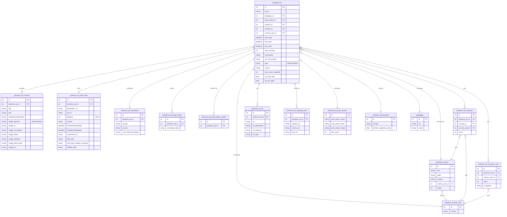

# Pinterest — ERD (SQL + Elasticsearch)

[← back to index](README.md) · MySQL DB `pasdev_pinterest` · ES index `pinterest_search_mix` (shared 6.8)

Source of truth: [src/services/pinterest/insertion/repository.js](../../src/services/pinterest/insertion/repository.js),
[esColumns.js](../../src/services/pinterest/insertion/esColumns.js),
[esDocBuilder.js](../../src/services/pinterest/insertion/esDocBuilder.js).

> Variants carry `target_keyword` (pipe‑delimited). `pinterest_ad` adds `ad_start_date`/`ad_end_date`.
> **Platform‑15** ads emit extra targeting fields into ES (interests, reach by country, etc.).

---

## SQL ERD

**Also present:** `pinterest_hidden_ads` (ad_id, user_id, type 1/2/3),
`pinterest_ad_recommended_activity`, `pinterest_account_activities` (platform‑10 tracking).

---

## Elasticsearch — index `pinterest_search_mix`

Document = one ad, **nested‑dotted** keys. `_id` = internal `pinterest_ad.id`.

| Group | Fields |
|---|---|
| Core | `pinterest_ad.id`, `post_date`, `last_seen`, `first_seen`, `days_running`, `ad_position`, `ad_sub_position`, `type`, `platform`, `pinterest_ad.country` (array) |
| Creative | `pinterest_ad_variants.title`, `.text`, `.newsfeed_description`, `.image_object`, `.image_celebrity`, `.image_brand_logo`, `.image_ocr` — fanned `_ru _fr _sp _ge _exactly`; plus `.target_keyword` (array) |
| Advertiser | `pinterest_ad_post_owners.post_owner_name` (+lang), `.post_owner_lower`, `.post_owner_image` |
| Geo / lang | `pinterest_country_only.country`, `states` (array), `city` (array), `lang_detect` |
| Lander / meta | `pinterest_ad_meta_data.destination_url`, `.firstSeenOnDesktop`, `.built_with`, `.affiliate_data`, `.built_with_analytics_tracking`, `pinterest_ad_domains.domain`, `.domain_registered_date` |
| URLs | `pinterest_ad_url.url`, `.url_destination`, `.url_redirects`, `pinterest_ad_outgoing_links.source_url`, `.redirect_url`, `.final_url` |
| Media | `image_url`, `new_nas_image_url`, `thumbnail` (VIDEO), `image_url_original`, `post_owner_image` |
| Translation | `pinterest_translations.<lang>` |
| **Platform‑15 targeting** | `ad_start_date`, `ad_end_date`, `interests` (array), `keywords_used` (array), `negative_keywords_used` (array), `pinner_list_types`, `pinner_regionslist_types`, `postal_codes`, `reach_count_eu_low`, `reach_count_eu_high`, `reach_count_by_country` (object) |
