# Quora — ERD (SQL + Elasticsearch)

[← back to index](README.md) · MySQL DB `pasdev_quora` · ES index `quora_search_mix` (shared 6.8)

Source of truth: [src/services/quora/insertion/repository.js](../../src/services/quora/insertion/repository.js),
[esColumns.js](../../src/services/quora/insertion/esColumns.js),
[esDocBuilder.js](../../src/services/quora/insertion/esDocBuilder.js).

> Variants carry both `image_url` (→ ES `new_nas_image_url`) and `video_url`; the media row's
> `ad_image_video` maps to ES `thumbnail`. Translation row stores `detected_language`.

---

## SQL ERD

```mermaid
erDiagram
    quora_ad ||--o{ quora_ad_variants : "creatives"
    quora_ad ||--o| quora_ad_meta_data : "meta"
    quora_ad ||--o| quora_ad_translation : "translated"
    quora_ad ||--o| quora_ad_image_video : "media"
    quora_ad ||--o{ quora_ad_countries : "geo"
    quora_ad ||--o{ quora_ad_countries_only : "geo"
    quora_ad ||--o{ quora_ad_url : "urls"
    quora_ad ||--o{ quora_ad_outgoing_links : "redirects"
    quora_ad ||--o{ quora_ad_users : "discovery"
    quora_ad ||--o{ quora_ad_analytics : "daily"
    quora_ad ||--o{ quora_comments : "comments"
    quora_ad }o--|| quora_ad_post_owners : "advertiser"
    quora_ad }o--|| quora_category : "category"
    quora_ad }o--|| quora_country : "primary geo"
    quora_ad }o--|| quora_ad_domain : "domain"
    quora_ad }o--|| quora_call_to_action : "CTA"
    quora_ad }o--|| quora_user : "discoverer"
    quora_ad }o--|| languages : "language"

    quora_ad {
        int id PK
        string ad_id "unique"
        int discoverer_user_id FK
        string platform
        int status
        int hits
        datetime post_date
        datetime first_seen
        datetime last_seen
        int days_running
        int likes
        int comments
        int shares
        datetime created_date
        int ad_position
        string type
        int post_owner_id FK
        int category_id FK
        int country_id FK
        int domain_id FK
        int call_to_action_id FK
        int language_id FK
        int System_id
    }
    quora_ad_post_owners {
        int id PK
        string post_owner_name
        string post_owner_lower
        string post_owner_image
        string original_post_owner_image
        int ads_count
        date page_created_date
    }
    quora_ad_variants {
        int id PK
        int quora_ad_id FK
        string title
        string text
        string newsfeed_description
        string image_url
        string image_url_original
        string image_object
        string image_celebrity
        string image_brand_logo
        string image_ocr
        string video_url
        string tags
    }
    quora_ad_meta_data {
        int id PK
        int quora_ad_id FK
        string destination_url
        string ad_url
        string built_with
        string built_with_analytics_tracking
        string affiliate_data
        string screenshot_url
        string blackhat_path
    }
    quora_ad_translation {
        int id PK
        int quora_ad_id FK
        string ad_text
        string ad_title
        string news_feed_description
        string detected_language
    }
    quora_ad_image_video {
        int id PK
        int quora_ad_id FK
        string ad_image_video
    }
    quora_ad_url {
        int id PK
        int quora_ad_id FK
        string url_type
        string url
        string country_code
        string url_destination
        string url_redirects
    }
    quora_ad_outgoing_links {
        int id PK
        int quora_ad_id FK
        string source_url
        string redirect_url
        string final_url
    }
    quora_ad_countries {
        int id PK
        int quora_ad_id FK
        string country
    }
    quora_ad_countries_only {
        int id PK
        int quora_ad_id FK
        string country
    }
    quora_ad_users {
        int id PK
        int quora_ad_id FK
        int quora_user_id
    }
    quora_ad_analytics {
        int id PK
        int quora_ad_id FK
    }
    quora_comments {
        int id PK
        int quora_ad_id FK
    }
    quora_call_to_action {
        int id PK
        string call_to_action
    }
    quora_category {
        int id PK
        string category_name
    }
    quora_country {
        int id PK
        string country
    }
    quora_ad_domain {
        int id PK
        string domain
        date domain_registered_date
    }
    quora_user {
        int id PK
        string quora_id
        string Gender
    }
    languages {
        int id PK
        string iso
        string name
    }
```

**Also present:** `quora_ad_bug_report` (keyed by `ad_id`).

---

## Elasticsearch — index `quora_search_mix`

Document = one ad, **nested‑dotted** keys. `_id` = internal `quora_ad.id`.

| Group | Fields |
|---|---|
| Core | `quora_ad.id`, `discoverer_user_id`, `platform`, `status`, `hits`, `post_date`, `last_seen`, `lower_age`, `days_running`, `likes`, `comments`, `shares`, `created_date`, `ad_position`, `type` |
| Creative | `quora_ad_variants.title`, `.text`, `.newsfeed_description`, `.image_object`, `.image_celebrity`, `.image_brand_logo`, `.image_ocr`, `.image_url_original`; `quora_ad_variants.image_url` → **`new_nas_image_url`** |
| Advertiser | `quora_ad_post_owners.post_owner_name`, `.post_owner_lower`, `.post_owner_image`, `.page_created_date` |
| Lander / meta | `quora_ad_meta_data.destination_url`, `.built_with`, `.built_with_analytics_tracking`, `.affiliate_data`, `quora_ad_url.url_destination`, `.url_redirects`, `quora_ad_outgoing_links.source_url`, `.redirect_url`, `.final_url`, `quora_ad_domains.domain_registered_date` |
| CTA / geo / user | `quora_call_to_action.call_to_action`, `quora_country.country`, `quora_user.Gender`, `quora_user_countries` (synthetic array), `quora_category.category_name`, `languages.iso` |
| Translation | `quora_ad_translation.ad_text`, `.ad_title`, `.news_feed_description`, `quora_translations.<lang>` |
| Media | `quora_ad_image_video.ad_image_video` → **`thumbnail`** |
| Synthetic | `html`, `mixdata`, `lang_detect` |
