# Reddit — ERD (SQL + Elasticsearch)

[← back to index](README.md) · MySQL DB `pasdev_reddit` · ES index `reddit_search_mix` (shared 6.8)

Source of truth: [src/services/reddit/insertion/repository.js](../../src/services/reddit/insertion/repository.js),
[esColumns.js](../../src/services/reddit/insertion/esColumns.js),
[esDocBuilder.js](../../src/services/reddit/insertion/esDocBuilder.js).

> `reddit_ad` caches `default_variant_id` / `default_analytics_id`; discoverer via `reddit_user`.
> `reddit_country_only` uses PK `country_only_id` / column `country_only`.

---

## SQL ERD

```mermaid
erDiagram
    reddit_ad ||--o{ reddit_ad_variants : "creatives"
    reddit_ad ||--o| reddit_ad_meta_data : "meta"
    reddit_ad ||--o| reddit_ad_translation : "translated"
    reddit_ad ||--o{ reddit_ad_analytics : "daily"
    reddit_ad ||--o| reddit_ad_image_video : "media"
    reddit_ad ||--o{ reddit_ad_countries : "geo"
    reddit_ad ||--o{ reddit_ad_countries_only : "geo"
    reddit_ad ||--o{ reddit_ad_url : "urls"
    reddit_ad ||--o{ reddit_ad_outgoing_links : "redirects"
    reddit_ad ||--o{ reddit_comments : "comments"
    reddit_ad ||--o{ reddit_ad_users : "discovery"
    reddit_ad }o--|| reddit_ad_post_owners : "advertiser"
    reddit_ad }o--|| reddit_call_to_action : "CTA"
    reddit_ad }o--|| reddit_category : "category"
    reddit_ad }o--|| reddit_ad_domain : "domain"
    reddit_ad }o--|| reddit_country : "primary geo"
    reddit_ad }o--|| reddit_user : "discoverer"
    reddit_ad }o--|| languages : "language"
    reddit_ad_countries }o--|| reddit_country : "geo"
    reddit_ad_countries_only }o--|| reddit_country_only : "geo"

    reddit_ad {
        int id PK
        string ad_id
        string platform
        string type
        datetime post_date
        datetime first_seen
        datetime last_seen
        datetime created_date
        int discoverer_user_id FK
        int ad_position
        string source
        int language_id FK
        int country_id FK
        int domain_id FK
        int post_owner_id FK
        int default_variant_id FK
        int default_analytics_id FK
        int call_to_action_id FK
        int category_id FK
        int likes
        int comments
        int shares
        int days_running
    }
    reddit_ad_post_owners {
        int id PK
        string post_owner_name
        string post_owner_lower
        string post_owner_image
        string original_post_owner_image
        int ads_count
        int image_updated
    }
    reddit_ad_variants {
        int id PK
        int reddit_ad_id FK
        string title
        string text
        string newsfeed_description
        string image_url
        string image_url_original
        string image_object
        string tags
    }
    reddit_ad_meta_data {
        int id PK
        int reddit_ad_id FK
        string ad_url
        string destination_url
        string built_with
        string built_with_analytics_tracking
        string affiliate_data
        string platform
        string screenshot_url
        int version
        datetime firstSeenOnDesktop
        datetime lastSeenOnDesktop
    }
    reddit_ad_translation {
        int id PK
        int reddit_ad_id FK
        string ad_title
        string ad_text
        string news_feed_description
    }
    reddit_ad_analytics {
        int id PK
        int reddit_ad_id FK
    }
    reddit_ad_image_video {
        int id PK
        int reddit_ad_id FK
        string ad_image_video
    }
    reddit_ad_url {
        int id PK
        int reddit_ad_id FK
        string url_type
        string url
        string country_code
        string url_destination
        string url_redirects
    }
    reddit_ad_outgoing_links {
        int id PK
        int reddit_ad_id FK
        string source_url
        string redirect_url
        string final_url
    }
    reddit_comments {
        int id PK
        int reddit_ad_id FK
    }
    reddit_ad_users {
        int id PK
        int reddit_ad_id FK
    }
    reddit_call_to_action {
        int id PK
        string call_to_action
    }
    reddit_category {
        int id PK
        string category_name
    }
    reddit_ad_domain {
        int id PK
        string domain
        date domain_registered_date
    }
    reddit_user {
        int id PK
        string reddit_username
        string Gender
    }
    reddit_country {
        int id PK
        string country
        string city
        string state
    }
    reddit_country_only {
        int country_only_id PK
        string country_only
    }
    reddit_ad_countries {
        int id PK
        int reddit_ad_id FK
    }
    reddit_ad_countries_only {
        int id PK
        int reddit_ad_id FK
        int country_only_id FK
    }
    languages {
        int id PK
        string iso
        string name
    }
```

**Also present:** `reddit_hidden_ads` (user_id, ad_id, type 1/2/3).

---

## Elasticsearch — index `reddit_search_mix`

Document = one ad, **nested‑dotted** keys. `_id` = internal `reddit_ad.id`.

| Group | Fields |
|---|---|
| Core | `reddit_ad.id`, `ad_id`, `platform`, `type`, `post_date`, `first_seen`, `last_seen`, `created_date`, `ad_position`, `source`, `language_iso`, `days_running`, `likes`, `comments`, `shares` |
| Creative | `reddit_ad_variants.title`, `.text`, `.newsfeed_description`, `.image_url`, `.image_url_original`, `.image_object`, `.image_brand_logo`, `.image_celebrity`, `.image_ocr` |
| Advertiser | `reddit_ad_post_owners.post_owner_name`, `.post_owner_lower`, `.post_owner_image` |
| CTA / geo / user | `reddit_call_to_action.call_to_action`, `reddit_country.country`, `reddit_user.Gender` |
| Lander / meta | `reddit_ad_meta_data.destination_url`, `.built_with`, `.built_with_analytics_tracking`, `.affiliate_data`, `.ad_url`, `.url_destination`, `.platform`, `.screenshot_url`, `.redirect_destination_url_source`, `.version`, `.destination_scraper_status`, `.firstSeenOnDesktop`, `.lastSeenOnDesktop`, `reddit_ad_domain.domain`, `.domain_registered_date` |
| URLs | `reddit_ad_url.url_destination`, `.url_redirects`, `reddit_ad_outgoing_links.source_url`, `.redirect_url`, `.final_url` |
| Media | `reddit_ad_image_video.othermedia` (parsed carousel JSON), `new_nas_image_url`, `Thumbnail` (VIDEO compat) |
| Translation / taxonomy | `reddit_translations.<lang>`, `lang_detect`, `reddit.category`, `reddit.subCategory` |

> Date formats: `post_date`/`first_seen`/`last_seen` → `yyyy-MM-dd HH:mm:ss`; `created_date` → ISO;
> `domain_registered_date` → `yyyy-MM-dd`.
