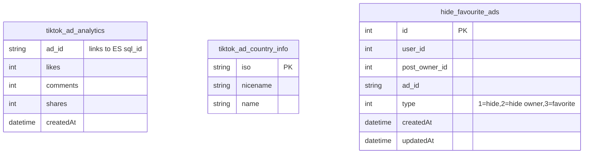

# TikTok — ERD (SQL + Elasticsearch)

[← back to index](README.md) · MySQL DB `tiktok_database_development` · ES index `tiktok_ads` (**separate ES 8.1 cluster**, config key `elastic_tiktok`)

Source of truth: [src/services/tiktok/builders/TiktokSearchQueryBuilder.js](../../src/services/tiktok/builders/TiktokSearchQueryBuilder.js),
[controllers/adSearchController.js](../../src/services/tiktok/controllers/adSearchController.js).

> **TikTok is READ‑ONLY** in this codebase — there is no `insertion/` folder. Ads are ingested by an
> external system; this API only **searches** the `tiktok_ads` index (ES 8.1) and writes user
> favorites/hides to SQL. Its ES doc is **flat** with a couple of nested targeting objects.

---

## SQL ERD

TikTok does **not** maintain a normalized ad graph here. It touches only a few SQL tables:

- `tiktok_ad_analytics` — read for engagement overlays (keyed by `ad_id`).
- `tiktok_ad_country_info` — ISO ↔ name lookup for geo filters.
- `hide_favourite_ads` — the **only write target**: per‑user hide/favorite state.

The authoritative ad data lives entirely in Elasticsearch.

---

## Elasticsearch — index `tiktok_ads` (FLAT, ES 8.1)

Document = one ad. `_id` ≈ `sql_id`. Note: ES 8.1 is **typeless** and has no `case_insensitive`
term option (unlike the 6.8 cluster the other networks use).

| Group | Fields |
|---|---|
| Identity | `sql_id` (PK) |
| Creative | `ad_title`, `ad_text`, `target_keywords`, `industry`, `library_url` |
| Advertiser | `post_owner`, `post_owner_id` |
| Media | `video_url`, `video_cover` |
| Lander | `destination_url`, `domain_registered_date` |
| Budget / lang | `budget`, `language` |
| Geo | `countries` (array) |
| Targeting (nested) | `gender.gender_details.*`, `age.age_details.*` (e.g. `"55+"`) |
| Engagement | `likes`, `comments`, `shares`, `ctr`, `popularity`, `impression` |
| Timeline | `first_seen`, `last_seen`, `days_running` |
