# YouTube — ERD (SQL + Elasticsearch)

[← back to index](README.md) · MySQL DB `pasdev_youtube` · ES index `youtube_ads_data` (shared 6.8)

Source of truth: [src/services/youtube/insertion/repository.js](../../src/services/youtube/insertion/repository.js),
[esColumns.js](../../src/services/youtube/insertion/esColumns.js),
[esDocBuilder.js](../../src/services/youtube/insertion/esDocBuilder.js).

> **Video network.** Variants store `video_url`/`thumbnail_url`/`channal_url`; image AI lives in
> `youtube_ad_ocb`; analytics track likes/dislikes/views. **ES doc is FLAT** (friendly top‑level
> keys, dates as UNIX epoch ints).

---

## SQL ERD

```mermaid
erDiagram
    youtube_ad ||--o{ youtube_ad_variants : "creatives (video)"
    youtube_ad ||--o{ youtube_ad_meta_data : "meta"
    youtube_ad ||--o| youtube_ad_ocb : "image AI"
    youtube_ad ||--o| youtube_ad_image_video : "media"
    youtube_ad ||--o{ youtube_ad_analytics : "daily"
    youtube_ad ||--o| youtube_ad_translation : "translated"
    youtube_ad ||--o{ youtube_ad_countries : "geo"
    youtube_ad ||--o{ youtube_ad_countries_only : "geo"
    youtube_ad ||--o{ youtube_ad_url : "urls"
    youtube_ad ||--o{ youtube_ad_outgoing_links : "redirects"
    youtube_ad }o--|| youtube_ad_post_owners : "channel"
    youtube_ad }o--|| youtube_call_to_actions : "CTA"
    youtube_ad }o--|| youtube_ad_domains : "domain"
    youtube_ad }o--|| youtube_category : "category"
    youtube_ad }o--|| youtube_country : "primary geo"
    youtube_ad }o--|| youtube_country_only : "geo rollup"
    youtube_ad }o--|| languages : "language"
    youtube_country }o--|| youtube_country_only : "rolls up"
    youtube_ad_countries }o--|| youtube_country : "geo"
    youtube_ad_countries }o--|| youtube_country_only : "geo"
    youtube_ad_countries_only }o--|| youtube_country_only : "geo"

    youtube_ad {
        int id PK
        string ad_id
        int post_owner_id FK
        int call_to_action_id FK
        int country_only_id FK
        int country_id FK
        int language_id FK
        int domain_id FK
        int category_id FK
        int discoverer_user_id
        string type
        int ad_position
        int likes
        int dislikes
        int comments
        int views
        datetime post_date
        datetime first_seen
        datetime last_seen
        int days_running
        int lower_age_seen
        int upper_age_seen
    }
    youtube_ad_post_owners {
        int id PK
        string post_owner_name
        string post_owner_lower "GENERATED"
        string channal_url
        string post_owner_image
        string original_post_owner_image
        int ads_count
        int verified
    }
    youtube_ad_variants {
        int id PK
        int youtube_ad_id FK
        string title
        string text
        string newsfeed_description
        string video_url
        string video_url_original
        string thumbnail_url
        string thumbnail_url_original
        string channal_url
        string tags
    }
    youtube_ad_ocb {
        int id PK
        int youtube_ad_id FK
        string object
        string celebrity
        string brand_logo
    }
    youtube_ad_meta_data {
        int id PK
        int youtube_ad_id FK
        string ad_url
        string destination_url
        string platform
        string built_with
        string built_with_analytics_tracking
        string affiliate_data
        string screenshot_url
        datetime firstSeenOnDesktop
        datetime lastSeenOnDesktop
        int version
    }
    youtube_ad_image_video {
        int id PK
        int youtube_ad_id FK
        string ad_type
        string ad_image_video
    }
    youtube_ad_analytics {
        int id PK
        int youtube_ad_id FK
        int views
        int likes
        int dislike
        int comments
        date date
    }
    youtube_ad_translation {
        int id PK
        int youtube_ad_id FK
        string ad_title
        string ad_text
        string news_feed_description
    }
    youtube_ad_url {
        int id PK
        int youtube_ad_id FK
        string url_type
        string url
        string country_code
    }
    youtube_ad_outgoing_links {
        int id PK
        int youtube_ad_id FK
        string source_url
        string redirect_url
        string final_url
    }
    youtube_ad_countries {
        int id PK
        int youtube_ad_id FK
        int country_id FK
        int country_only_id FK
        int count
    }
    youtube_ad_countries_only {
        int id PK
        int youtube_ad_id FK
        int country_only_id FK
        int count
    }
    youtube_country {
        int id PK
        string city
        string state
        string country
        int country_only_id FK
        int status
    }
    youtube_country_only {
        int id PK
        string country
    }
    youtube_ad_domains {
        int id PK
        string domain
        date domain_registered_date
    }
    youtube_category {
        int id PK
        string category_name
    }
    youtube_call_to_actions {
        int id PK
        string action
        int count
    }
    languages {
        int id PK
        string iso
        string name
    }
```

**Also present:** `youtube_hidden_ads` (type 1/2/3), `youtube_ad_bug_report`,
`youtube_ad_html_lander_content`, `youtube_users` / `youtube_account_activities` (platform tracking).

---

## Elasticsearch — index `youtube_ads_data` (FLAT)

Document = one ad, **flat** keys. `_id` = internal `youtube_ad.id`. Dates are **UNIX epoch ints**.

| Group | Fields |
|---|---|
| Core | `ad_id`, `post_date`, `first_seen`, `last_seen`, `ad_type` (VIDEO/DISCOVERY/IMAGE/DISPLAY), `ad_position`, `duration`, `source`, `ad_language`, `discoverer_user_id`, `lower_age_seen` |
| Creative | `ad_title`, `ad_text`, `newsfeed_description`, `hastags`, `text_image_title`, `html_text` |
| Channel / owner | `post_owner`, `post_owner_id`, `post_owner_image`, `verified` |
| Media | `ad_image_or_video`, `thumbnail_url`, `image_url_original`, `new_nas_image_url`, `nas_video_url`, `call_to_action` |
| Image AI | `image_ocr`, `image_object` (array), `image_brand`, `image_celebrity` (array) |
| Engagement | `reactions` *(object `{likes}`)*, `comments`, `views`, `impression`, `popularity` |
| Lander / meta | `destination_url`, `redirect_urls` (array), `landing_urls`, `landing_text`, `affiliate_networks`, `ecommerce_platform`, `funnel`, `platform`, `domain_registration_date` |
| Geo | `countries` (array), `states` (array), `city` (array) |
| Budget / taxonomy | `youtube.lowerBudget`, `youtube.upperBudget`, `youtube.averageBudget`, `youtube.category`, `youtube.subCategory` |
| Translation | `youtube_translations.<lang>` (per‑language overlays) |
| AI creative scores | `creative_predicted_ctr`, `creative_hook_score`, `creative_hold_score`, `creative_hook_total`, `creative_hold_total`, `creative_total_score`, `creative_score_rationale`, `creative_scored_at`, `creative_scored_by` |
